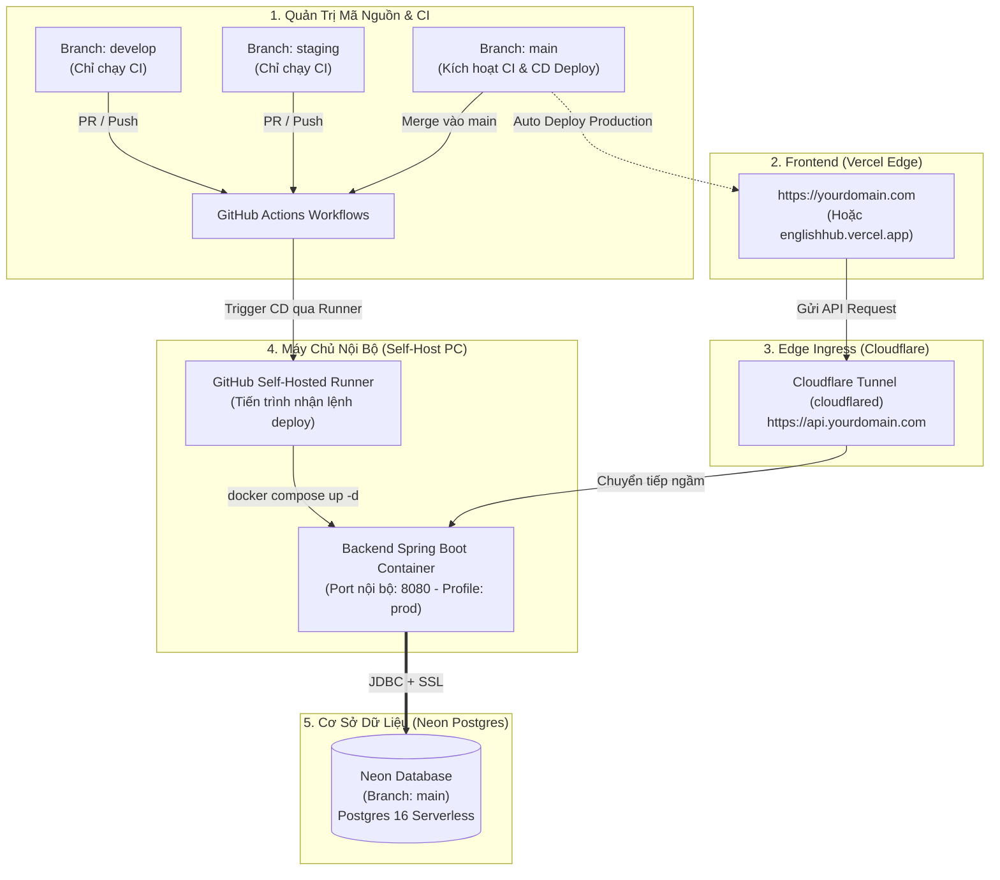

# Kế Hoạch Triển Khai CI/CD & Kiến Trúc Tinh Gọn - EnglishHub

> **Tài liệu quy hoạch hệ thống CI/CD cho dự án EnglishHub**  
> **Mô hình**: Hybrid Cloud & On-Premises Tinh Gọn (Vercel + Self-Host PC + Neon Serverless + Cloudflare Tunnel + GitHub Actions)  
> **Chiến lược phân nhánh**: `develop` và `staging` chỉ đóng vai trò phân nhánh mã nguồn trên Git và chạy kiểm thử tự động (CI); **chỉ nhánh `main` mới kích hoạt triển khai thực tế (CD)**.

---

## 1. Vai Trò Các Nhánh Git (Git Flow & Delivery Strategy)

Hệ thống phân định rõ ranh giới giữa **Quản lý mã nguồn (CI)** và **Triển khai thực tế (CD)**:

```text
[feature/*] ──► (PR) ──► [develop] ──► (PR / Release) ──► [staging] ──► (Merge) ──► [main]
                           │                                  │                        │
                           ▼                                  ▼                        ▼
                      CI Tự Động                         CI Tự Động              CI + CD DEPLOY
                  (Lint, Typecheck,                  (Integration Test,         (Deploy Vercel &
                     Unit Test)                        Flyway Check)             Deploy PC Server)
```

1. **Nhánh `develop` (Tích hợp liên tục - Development Integration)**:
   - Dùng để gom mã nguồn từ các nhánh tính năng (`feat/*`, `bugfix/*`).
   - **CI**: Tự động chạy ESLint, TypeScript Build, Gradle Unit Test mỗi khi có Pull Request hoặc Push.
   - **CD**: *Không deploy*.
2. **Nhánh `staging` (Đóng băng phát hành - Release Candidate)**:
   - Dùng làm chốt chặn cuối cùng trước khi đưa lên bản thương mại/chính thức. Đảm bảo mọi tính năng đã được kiểm thử ổn định, giải quyết xong xung đột.
   - **CI**: Chạy bộ kiểm thử toàn diện và kiểm tra tính tương thích của các script Flyway DB Migration.
   - **CD**: *Không deploy*.
3. **Nhánh `main` (Sản phẩm thực tế - Production)**:
   - Mã nguồn ổn định nhất, sẵn sàng phục vụ người dùng.
   - **CI & CD**: Tự động kích hoạt toàn bộ quy trình:
     - Frontend tự động build và deploy lên **Vercel** (gắn domain chính).
     - Backend tự động đóng gói Docker Image và kích hoạt **PC nội bộ** cập nhật container duy nhất đang chạy.

---

## 2. Sơ Đồ Kiến Trúc Hệ Thống Tinh Gọn

Vì chỉ deploy nhánh `main`, hệ thống trở nên cực kỳ gọn gàng, tiết kiệm tối đa RAM và CPU của máy tính cá nhân:



---

## 3. Bảng Cấu Hình Hạ Tầng Tinh Gọn

| Thành phần | Công nghệ / Nền tảng | Cấu hình & Vai trò |
| :--- | :--- | :--- |
| **Frontend** | **Vercel** | - Chỉ kết nối Production với nhánh `main`.<br>- Tự động build và phân phối qua CDN toàn cầu.<br>- Biến môi trường: `VITE_API_URL=https://api.yourdomain.com/api`. |
| **Backend** | **Self-Host PC (Docker)** | - Chạy **duy nhất 1 container** `englishhub-backend-prod` trên cổng `8080`.<br>- Cấu hình RAM JVM: `-Xms256m -Xmx768m` (vô cùng nhẹ nhàng cho PC).<br>- Profile: `SPRING_PROFILES_ACTIVE=prod`. |
| **Database** | **Neon PostgreSQL** | - Chạy trực tiếp trên mây (AWS/GCP qua Neon).<br>- Nhánh DB chính: `main`.<br>- Kết nối qua JDBC SSL: `?sslmode=require`. |
| **Tunnel / Ingress** | **Cloudflare Tunnel** | - Ánh xạ duy nhất: `api.yourdomain.com` ➔ `http://localhost:8080`.<br>- Tự động cấp chứng chỉ HTTPS/SSL miễn phí, bảo vệ chống DDoS. |
| **Tự động hóa CD** | **GitHub Self-Hosted Runner** | - Cài đặt chạy ngầm trên PC.<br>- Nhận diện tín hiệu merge `main` từ GitHub để cập nhật container trong vòng 30 giây. |

---

## 4. Chi Tiết Các Bước Cài Đặt

### Bước 1: Tạo Database Neon
1. Đăng ký tài khoản tại [neon.tech](https://neon.tech/) và tạo project mới: `englishhub`.
2. Lấy chuỗi kết nối JDBC tại Dashboard (mục Connection String -> chọn JDBC):
   ```text
   jdbc:postgresql://<neon_endpoint>.tech/neondb?sslmode=require
   ```
3. Lưu lại Username, Password và URL để điền vào file `.env` trên PC.

---

### Bước 2: Chuẩn Bị File Docker Compose Trên PC (`docker-compose.yml`)
Tại PC của bạn (ví dụ thư mục `C:\deployment\englishhub` hoặc `/opt/englishhub`), bạn chỉ cần duy nhất một file compose đơn giản:

```yaml
services:
  backend:
    image: ghcr.io/${GITHUB_REPOSITORY}/backend:latest
    container_name: englishhub-backend-prod
    restart: unless-stopped
    ports:
      - "8080:8080"
    environment:
      SPRING_PROFILES_ACTIVE: prod
      SPRING_DATASOURCE_URL: ${DB_URL}
      SPRING_DATASOURCE_USERNAME: ${DB_USER}
      SPRING_DATASOURCE_PASSWORD: ${DB_PASSWORD}
      JWT_SECRET: ${JWT_SECRET}
      OPENAI_API_KEY: ${OPENAI_API_KEY:-}
      JAVA_TOOL_OPTIONS: "-Xms256m -Xmx768m"
    networks:
      - englishhub_network

networks:
  englishhub_network:
    driver: bridge
```

Kèm theo file `.env` đặt cùng thư mục:
```env
GITHUB_REPOSITORY=hotung9108/englishhub
DB_URL=jdbc:postgresql://<neon_endpoint>.tech/neondb?sslmode=require
DB_USER=your_neon_user
DB_PASSWORD=your_neon_password
JWT_SECRET=your_super_secret_jwt_key_at_least_32_characters
OPENAI_API_KEY=your_openai_api_key_if_any
```

---

### Bước 3: Cài Đặt Cloudflare Tunnel Trên PC
1. Vào **Cloudflare Zero Trust** -> **Networks** -> **Tunnels** -> **Create a Tunnel**.
2. Chọn hệ điều hành máy tính của bạn và làm theo câu lệnh Cloudflare hướng dẫn để cài đặt service `cloudflared`.
3. Trong phần **Public Hostname**:
   - **Subdomain**: `api` (Domain: `yourdomain.com`).
   - **Service**: `HTTP` trỏ vào `localhost:8080`.
4. *Kết quả*: Mọi request gửi tới `https://api.yourdomain.com` sẽ được Cloudflare định tuyến an toàn tới backend trên PC của bạn.

---

### Bước 4: Cấu Hình Frontend Trên Vercel
1. Truy cập [vercel.com](https://vercel.com/) -> Import repository `EnglishHub`.
2. Thiết lập:
   - **Framework Preset**: Vite
   - **Root Directory**: `frontend`
3. Trong mục **Environment Variables**:
   - Tên biến: `VITE_API_URL`
   - Giá trị: `https://api.yourdomain.com/api`
   - Môi trường áp dụng: **Production** & **Preview**.
4. Bấm **Deploy**. Giờ đây mỗi khi nhánh `main` có commit mới, Vercel sẽ tự động build và cập nhật web.

---

### Bước 5: Cấu Hình CI/CD GitHub Actions (Chỉ Deploy Khi Merge Main)

#### 1. Cài đặt GitHub Actions Self-Hosted Runner trên PC
- Vào GitHub Repository: **Settings** -> **Actions** -> **Runners** -> **New self-hosted runner**.
- Làm theo các bước tải Runner về PC và chạy lệnh cài đặt làm Service chạy ngầm.

#### 2. Workflow CD (`.github/workflows/cd-deploy.yml`)
Workflow chỉ chạy khi nhánh `main` được cập nhật:

```yaml
name: CD Deploy (Production Only)

on:
  push:
    branches:
      - main

env:
  REGISTRY: ghcr.io
  IMAGE_NAME: ${{ github.repository }}/backend

jobs:
  # Bước 1: Build Docker Image trên Cloud của GitHub
  build-and-push:
    name: Build & Push Docker Image
    runs-on: ubuntu-latest
    permissions:
      contents: read
      packages: write

    steps:
      - name: Checkout Code
        uses: actions/checkout@v4

      - name: Set up Docker Buildx
        uses: docker/setup-buildx-action@v3

      - name: Log in to GitHub Container Registry
        uses: docker/login-action@v3
        with:
          registry: ${{ env.REGISTRY }}
          username: ${{ github.actor }}
          password: ${{ secrets.GITHUB_TOKEN }}

      - name: Build and Push Backend
        uses: docker/build-push-action@v6
        with:
          context: ./backend
          file: ./backend/Dockerfile
          push: true
          tags: ${{ env.REGISTRY }}/${{ env.IMAGE_NAME }}:latest
          cache-from: type=gha
          cache-to: type=gha,mode=max

  # Bước 2: Ra lệnh cho PC kéo Image mới và khởi động lại
  deploy-to-pc:
    name: Deploy to Self-Host PC
    needs: build-and-push
    runs-on: self-hosted

    steps:
      - name: Pull Latest Image and Restart Backend
        shell: powershell # hoặc bash nếu PC chạy Linux
        run: |
          cd C:\deployment\englishhub
          echo "${{ secrets.GITHUB_TOKEN }}" | docker login ghcr.io -u "${{ github.actor }}" --password-stdin
          docker compose pull backend
          docker compose up -d backend
          docker image prune -f
          Write-Host "Cập nhật Backend thành công trên Self-Host PC!"
```

---

## 6. Xử Lý Kịch Bản PC Tắt & Tự Động Kéo Code Khi Bật Lại (Offline Catch-Up)

Rất nhiều trường hợp bạn không bật PC 24/7 (tắt máy đi ngủ, cúp điện, đi công tác). **Hệ thống hoàn toàn có thể tự động kéo bản mới nhất về chạy ngay khi bạn bật máy lại** nhờ sự kết hợp của 2 cơ chế:

### Cơ Chế 1: Hàng Đợi Tự Nhiên Của GitHub Actions (Job Queuing - Tối đa 24 giờ)
- Khi bạn merge code vào `main` trong lúc **PC đang tắt**:
  1. GitHub Actions Cloud vẫn chạy bình thường: Build xong Docker Image và đẩy lên `ghcr.io`.
  2. Bước `deploy-to-pc` nhắm vào `runs-on: self-hosted` sẽ nhận thấy Runner đang Offline ➔ GitHub tự động đưa Job này vào **hàng đợi (Queue)** và chờ đợi tối đa **24 giờ**.
  3. Khi bạn **bật PC lên**: Dịch vụ GitHub Runner trên PC tự kết nối lại với GitHub ➔ GitHub lập tức "nhả" Job đang chờ xuống ➔ PC tự động kéo image mới và cập nhật container ngay!

### Cơ Chế 2: Kịch Bản Đồng Bộ Khi Khởi Động Máy (Auto-Sync on Boot - Khuyên Dùng)
Để đảm bảo **100% dù bạn tắt máy 3 ngày hay 1 tháng**, hễ bật máy lên là luôn chạy bản mới nhất trên `main` mà không cần phụ thuộc vào hàng đợi GitHub Actions:

#### Thiết lập Script tự chạy khi mở máy (Trên Windows):
1. Tạo một file script tại thư mục triển khai: `C:\deployment\englishhub\auto-start.bat` (hoặc `.ps1`):
   ```bat
   @echo off
   echo [EnglishHub] Dang kiem tra va khoi chay ban backend moi nhat...
   cd /d C:\deployment\englishhub
   :: Doi 10 giay de Docker Desktop va mang Internet khoi dong xong
   timeout /t 10 /nobreak >nul
   :: Tu dong keo image moi nhat neu co commit moi
   docker compose pull backend
   :: Khoi dong container backend
   docker compose up -d backend
   echo [EnglishHub] He thong da san sang hoat dong!
   ```
2. Đưa script vào **Windows Startup** hoặc **Task Scheduler**:
   - Nhấn `Win + R`, gõ `shell:startup` rồi nhấn Enter.
   - Tạo shortcut của file `auto-start.bat` dán vào thư mục này.
   - *Kết quả*: Mỗi khi bạn bật máy tính và đăng nhập vào Windows:
     - PC tự động hỏi `ghcr.io` xem có bản backend mới nào chưa được tải về không.
     - Nếu có commit mới đã build: PC tải về và chạy ngay.
     - Nếu không có commit mới: Docker giữ nguyên bản cũ và khởi động trong 2 giây.

---

## 7. Tóm Tắt Quy Trình Hoạt Động Hàng Ngày Của Team

1. Lập trình viên tạo nhánh `feat/ten-chuc-nang` từ `develop`.
2. Tạo Pull Request vào `develop`:
   - GitHub Actions chạy **CI** kiểm tra lỗi cú pháp (Lint), Typescript và Unit Test.
   - Không có gì bị deploy lên server thật, dev hoàn toàn yên tâm code.
3. Khi chuẩn bị phát hành tính năng, tạo PR gộp từ `develop` vào `staging`:
   - **CI** chạy kiểm thử tổng hợp và kiểm tra tương thích migration cơ sở dữ liệu.
4. Khi phiên bản đã hoàn toàn ổn định trên `staging`:
   - Tạo PR gộp `staging` vào `main`.
   - Ngay khi merge:
     - **Vercel** tự động deploy phiên bản Frontend mới nhất.
     - **GitHub Actions** tự động build Docker và đẩy lên `ghcr.io`.
     - Nếu PC đang bật: PC tự kéo image về cập nhật trong vòng 30 giây.
     - Nếu PC đang tắt: Lần tiếp theo bạn bật máy, PC sẽ **tự động kéo bản mới về và chạy**!

---
*Tài liệu được cập nhật và lưu trữ tại [docs/CI_CD_PLAN.md](file:///d:/Codin/utc-code/HK4_1/Project1/EnglishHub/docs/CI_CD_PLAN.md).*

