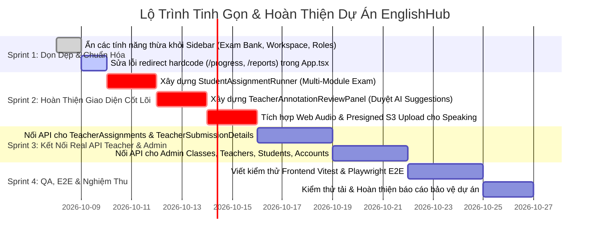

# Báo Cáo Phân Tích Khoảng Thiếu Kỹ Thuật So Với Core SRS, Các Tính Năng Dư Thừa & Lộ Trình Hoàn Thiện (Core Gap & Redundancy Analysis)

> **Dự án**: EnglishHub — Hệ thống Quản lý & Chấm chữa bài tập Tiếng Anh Thông minh  
> **Ngày cập nhật**: 08/10/2026  
> **Người thực hiện**: Hệ thống Phân tích Antigravity Agent  
> **Cơ sở đối chiếu**: Toàn bộ tài liệu kỹ thuật cốt lõi (`docs/core/`: 00.PI, 01.SRS, 02.PP, 03.TP) đối chiếu với Mã nguồn thực tế hiện hữu (Spring Boot Backend, FastAPI AI Service, React 19 Frontend, Flyway Migrations).

---

## 1. Tóm Tắt Trạng Thái Dự Án (Executive Summary)

Trải qua các chu kỳ phát triển liên tục (`BE-TASK-10` đến `BE-TASK-16`, `TASK-FE-AXIOS-INTEGRATION`, `TASK-FE-08`, v.v.), hệ thống **EnglishHub** đã đạt bước nhảy vọt về mức độ hoàn thiện ở tầng Backend và AI Service, trong khi tầng Frontend đã định hình đầy đủ 46 trang giao diện nhưng đang trong quá trình chuyển dịch từ Mock Data sang Real API:

| Khối thành phần | Tỷ lệ hoàn thiện ước tính | Đánh giá hiện trạng | Điểm nghẽn chính cần giải quyết |
| :--- | :---: | :--- | :--- |
| **Cơ sở dữ liệu (Database)** | **98%** | Lược đồ V6 hoàn chỉnh với 17 bảng nghiệp vụ, migrations Flyway (V1 - V6) hoạt động ổn định trên PostgreSQL 16. | Cần rà soát các cột/bảng thừa không nằm trong Core SRS (Plagiarism, Sessions). |
| **Backend API (Spring Boot)** | **98%** | **Hoàn thành 100% các cụm API nghiệp vụ (62/62 endpoints)**. Đã xong Cụm 7 (Student Evaluations #58-#62 trong `BE-TASK-10`), Auto-grading Engine (`BE-TASK-13`), và Unified AI Grading API (`BE-TASK-16`). Hơn 666+ automated tests chạy pass 100%. | Đang hoạt động hoàn chỉnh; cần kiểm tra tải và bảo đảm bảo mật token khi chạy môi trường thực tế. |
| **Trí tuệ nhân tạo (AI Engine)** | **85%** | **Đã thoát khỏi trạng thái Stub rỗng**: Xây dựng AI Microservice độc lập (`ai-service` FastAPI) với Google Gemini Flash multimodal, pipeline chấm Speaking (Whisper STT, Fluency metrics, Audio processing trong `BE-TASK-14`) và Writing (Text metrics, CEFR/IELTS rubrics, annotations trong `BE-TASK-15`). Backend Spring Boot đã kết nối qua `AiServiceClient`. | Cần kiểm tra hạn mức quota Gemini API Key thật trên môi trường Production và tối ưu thời gian phản hồi (caching). |
| **Giao diện người dùng (Frontend)** | **75%** | Đã xây dựng 46 màn hình bằng React 19, Vite, TypeScript. AuthContext đã kết nối JWT login thật. Phân hệ Học viên đã kết nối luồng nộp bài và xem kết quả thật. | **Nhiều trang Teacher & Admin vẫn dùng Mock Data tĩnh**; Luồng nộp âm thanh Speaking trên FE mới là giả lập; Thiếu Multi-module Exam Runner và Bảng duyệt AI Annotation. |
| **Hạ tầng & Vận hành (DevOps)** | **92%** | Đã cấu hình 8 GitHub Actions pipelines, Docker Compose đa dịch vụ (backend, ai-service, postgres, minio), mạng Tailscale Mesh VPN và bảo mật TruffleHog. | Cần kích hoạt pipeline build cho `ai-service` và cấu hình SSH Secrets deploy tự động lên VPS Production. |
| **Đảm bảo chất lượng (QA & Test)** | **75%** | Backend đạt 666+ tests (Unit + Integration Testcontainers). AI service có test suite riêng. Frontend có 9 test suites cho API service qua Node test runner. | **Frontend hoàn toàn thiếu kiểm thử tự động giao diện (Component Tests & E2E Tests)**. Chưa có kiểm thử tải tích hợp (Load Testing). |

---

## 2. 🚨 CÁC TÍNH NĂNG & THÀNH PHẦN DƯ THỪA SO VỚI ĐẶC TẢ CỐT LÕI (Redundant & Out-of-Scope Analysis)

Để dự án tập trung tối đa nguồn lực vào việc nghiệm thu đúng các mục tiêu của **Project 1** và không bị phân tán, dưới đây là danh sách phân tích toàn diện các thành phần **bị thừa, vượt quá phạm vi đặc tả Core SRS (`01.SRS.md`)**:

### 2.1. Thành Phần Dư Thừa Phía Cơ Sở Dữ Liệu & Backend

1. **Module Phát hiện Đạo văn (Plagiarism Detection Module)**:
   - *Hiện trạng*: Trong bảng CSDL `gradings` có các cột `is_plagiarism_flagged` (BOOLEAN) và `plagiarism_score` (NUMERIC).
   - *Đánh giá*: **VƯỢT PHẠM VI CORE SRS**. Đề tài Project 1 xác định rõ trọng tâm là quản lý bài tập 4 kỹ năng và chấm chữa thông minh bằng AI cho Speaking/Writing. Dự án không có yêu cầu hay cam kết thuật toán phát hiện đạo văn (Turnitin clone).
   - *Khuyến nghị*: Bỏ qua logic này, để trường giá trị mặc định `false`/`null`, không tốn công sức phát triển thêm UI hay AI service phát hiện đạo văn.
2. **Quản lý Phiên Đăng nhập Đa Thiết bị (Multi-Device Active Sessions Management)**:
   - *Hiện trạng*: Bảng `refresh_tokens` lưu chi tiết `ip_address`, `user_agent`, `revoked_at` phục vụ thu hồi token theo từng thiết bị.
   - *Đánh giá*: **VƯỢT PHẠM VI CORE SRS**. SRS chỉ yêu cầu đăng nhập, đăng xuất và phân quyền người dùng cơ bản. Quản lý danh sách thiết bị đang online là tính năng bảo mật nâng cao ngoài phạm vi.
   - *Khuyến nghị*: Giữ logic thu hồi token nội bộ khi logout, không phát triển màn hình giao diện quản lý thiết bị người dùng.
3. **Phân loại Task độc lập "Viết lại câu" (Sentence Rewrite as Standalone Task)**:
   - *Hiện trạng*: Trong Enum CSDL có `module_task_type.REWRITE`.
   - *Đánh giá*: Trong Core SRS, kỹ năng Đọc và Nghe làm việc với câu hỏi trắc nghiệm/điền từ ngắn, còn Viết là bài luận. Tách REWRITE thành loại task độc lập với giao diện riêng làm phức tạp hóa hệ thống một cách không cần thiết.

### 2.2. Thành Phần Dư Thừa Phía Giao Diện Người Dùng (Frontend UI)

1. **Ngân Hàng Đề Thi / Bài Tập Mẫu (`TeacherExamBank.tsx` - `/teacher/exam-bank`)**:
   - *Đánh giá*: **VƯỢT PHẠM VI (Out of Scope)**. Core SRS quy định giáo viên tạo bài tập trực tiếp cho lớp (UC11, UC12). Không có use case về kho đề thi trung tâm dùng chung.
   - *Xử lý*: Giữ trang ở dạng tham khảo phụ, ẩn liên kết khỏi Sidebar chính của giáo viên để tránh việc ban giám khảo/người chấm thắc mắc về tính đồng bộ dữ liệu.
2. **Lưu Trữ Lớp Học Độc Lập (`AdminClassArchive.tsx` - `/admin/classes/archive`)**:
   - *Đánh giá*: **DƯ THỪA (Redundant)**. SRS chỉ yêu cầu quản lý trạng thái lớp học (Mở/Đóng). Việc tách riêng trang lưu trữ làm rối luồng quản trị.
   - *Xử lý*: Chuyển thành bộ lọc trạng thái lớp học trong `Classes.tsx`, gỡ bỏ route riêng.
3. **Không Gian Làm Việc Tự Học Cá Nhân (`StudentWorkspace.tsx` - `/student/workspace`)**:
   - *Đánh giá*: **VƯỢT PHẠM VI (Out of Scope)**. Học viên chỉ có nghiệp vụ làm bài tập được giao và xem bài chữa. Workspace chứa ghi chú tự do không nằm trong SRS.
   - *Xử lý*: Ẩn khỏi Sidebar của học viên.
4. **Hòm Thư Phản Hồi Riêng Biệt (`StudentFeedback.tsx` - `/student/feedback`)**:
   - *Đánh giá*: **DƯ THỪA (Redundant)**. Lời phê bài nộp đã có ở trang kết quả từng bài, còn đánh giá của giáo viên đã có trong trang chi tiết lớp học.
   - *Xử lý*: Ẩn khỏi Sidebar, tập trung hiển thị nhận xét tại trang kết quả bài tập.
5. **Giao Diện Phân Quyền Động (`Roles.tsx` - `/admin/roles`)**:
   - *Đánh giá*: **VƯỢT PHẠM VI (Out of Scope)**. Hệ thống chỉ có 3 vai trò cố định (`ADMIN`, `TEACHER`, `STUDENT`) được mã hóa trong hệ thống. Việc quản lý ma trận phân quyền là dư thừa.
6. **Điều Hướng Tắt Bị Hardcode Trong `App.tsx`**:
   - Route `/progress` redirect cứng về `/teacher/classes/ENG-IELTS-6.5A/progress` (hardcode mã lớp `ENG-IELTS-6.5A`).
   - Route `/reports` redirect cứng về `/admin/reports` mà không kiểm tra vai trò người dùng.
   - Nhiều alias URL trùng lặp (`/teacher/assignments/:id/edit` vs `/teacher/assignments/edit/:id`, `/student/assignments/:id/result` vs `/student/submissions/:id`).

---

## 3. Bảng Đối Chiếu Toàn Diện 35+ Ca Sử Dụng (Core SRS vs. Hiện Trạng)

Dưới đây là bảng đối chiếu cập nhật chi tiết toàn bộ các Ca sử dụng theo Mục 2 của [`docs/core/01.SRS.md`](file:///d:/Codin/utc-code/HK4_1/Project1/EnglishHub/docs/core/01.SRS.md):

| STT | Tên Ca Sử Dụng (SRS) | Tác nhân | Backend API | Frontend UI | Trạng thái tích hợp | Khoảng thiếu kỹ thuật (Gap) & Cần làm |
| :---: | :--- | :---: | :---: | :---: | :---: | :--- |
| 1 | Đăng nhập | Admin, Teacher, Student | Hoàn thành | Hoàn thành | **ĐÃ TÍCH HỢP** | Đã kết nối `POST /api/v1/auth/login`, nhận JWT và lưu vào `tokenStorage`. |
| 2 | Đăng xuất | Admin, Teacher, Student | Hoàn thành | Hoàn thành | **ĐÃ TÍCH HỢP** | Đã gọi `POST /api/v1/auth/logout`, xóa token trên client và database. |
| 3 | Quản lý tài khoản cá nhân | Mọi người dùng | Hoàn thành | Hoàn thành | **ĐÃ TÍCH HỢP** | Trang Profile đã kết nối `userService.getProfile` và `userService.changePassword`. |
| 4 | Quản lý tài khoản người dùng | Admin | Hoàn thành | Hoàn thành UI | **Chưa tích hợp** | Trang `Accounts.tsx` đang dùng danh sách mẫu. Cần nối với `userService.list` và API khóa tài khoản. |
| 5 | Phân quyền người dùng | Admin | Hoàn thành | Giao diện tĩnh | **Thừa một phần** | Role là cố định. Cần gán quyền qua form sửa người dùng thay vì trang `Roles.tsx`. |
| 6 | Quản lý giáo viên | Admin | Hoàn thành | Hoàn thành UI | **Chưa tích hợp** | Trang `Teachers.tsx` đang dùng mock data. Cần nối với `userService.listTeachers`. |
| 7 | Quản lý học viên | Admin | Hoàn thành | Hoàn thành UI | **Chưa tích hợp** | Trang `Students.tsx` đang dùng mock data. Cần nối với `userService.listStudents`. |
| 8 | Quản lý lớp học | Admin, Teacher | Hoàn thành | Hoàn thành UI | **Chưa tích hợp** | Trang `Classes.tsx` đang dùng mock data. Cần nối với `classService.list`. |
| 9 | Quản lý thành viên lớp học | Admin, Teacher | Hoàn thành | Hoàn thành UI | **Chưa tích hợp** | Cần gọi `POST/DELETE /classes/{id}/members` khi thêm/xóa học sinh trong lớp. |
| 10 | Xem danh sách lớp học | Teacher, Student | Hoàn thành | Hoàn thành | **ĐÃ TÍCH HỢP (Student)** | Học viên đã gọi `classService.list`. Giáo viên cần nối với API theo token. |
| 11 | Quản lý bài tập (CRUD) | Teacher | Hoàn thành | Hoàn thành UI | **Chưa tích hợp** | Trang `TeacherAssignments.tsx` đang hiển thị mảng tĩnh. Cần gọi `assignmentService.listAssignments`. |
| 12 | Tạo bài tập đa kỹ năng | Teacher | Hoàn thành | Hoàn thành UI | **Chưa tích hợp** | `TeacherCreateAssignment.tsx` đang lưu vào React state. Cần gọi `POST /api/v1/assignments`. |
| 13 | Mở bài tập (Publish) | Teacher | Hoàn thành | Hoàn thành UI | **Chưa tích hợp** | Nút bấm Mở bài cần gọi `POST /api/v1/assignments/{id}/publish`. |
| 14 | Khóa bài tập (Close) | Teacher | Hoàn thành | Hoàn thành UI | **Chưa tích hợp** | Nút Khóa bài cần gọi `POST /api/v1/assignments/{id}/close`. |
| 15 | Xem danh sách bài tập | Student | Hoàn thành | Hoàn thành | **ĐÃ TÍCH HỢP** | Trang `StudentAssignments.tsx` đã gọi `assignmentService` và `submissionService`. |
| 16 | Bắt đầu làm bài (Start Attempt) | Student | Hoàn thành | Hoàn thành | **ĐÃ TÍCH HỢP** | Đã gọi `submissionService.startAttempt` và lấy danh sách `submission_modules`. |
| 17 | Làm bài tập Viết (Writing) | Student | Hoàn thành | Hoàn thành | **ĐÃ TÍCH HỢP (Text)** | Đã nộp nội dung bài viết qua `submitModule`. Còn thiếu tải file `.docx` lên S3 qua Presigned URL. |
| 18 | Làm bài tập Nói (Speaking) | Student | Hoàn thành | Hoàn thành UI | **Thiếu tải S3 thật** | Nút ghi âm mới là timer ảo. Cần hook Web Audio tạo blob và tải lên qua Presigned S3 URL. |
| 19 | Làm bài tập Đọc (Reading) | Student | Hoàn thành | Hoàn thành | **ĐÃ TÍCH HỢP** | Đã gửi mảng đáp án trắc nghiệm qua `submitModule`. |
| 20 | Làm bài tập Nghe (Listening) | Student | Hoàn thành | Hoàn thành | **ĐÃ TÍCH HỢP** | Đã phát âm thanh và gửi đáp án qua `submitModule`. |
| 21 | Xem lại bài làm trước khi nộp | Student | Hoàn thành | Hoàn thành | **ĐÃ TÍCH HỢP** | Đã hiển thị câu hỏi và đáp án trước khi bấm xác nhận nộp. |
| 22 | Nộp bài tập chính thức | Student | Hoàn thành | Hoàn thành | **ĐÃ TÍCH HỢP** | Đã gọi `POST /submissions/{id}/submit` chốt trạng thái `SUBMITTED`. |
| 23 | Quản lý lượt làm bài | Student | Hoàn thành | Hoàn thành | **ĐÃ TÍCH HỢP** | Màn hình `StudentAssignmentOverview` đã hiển thị số lượt đã làm và số lượt cho phép. |
| 24 | Xem trạng thái bài làm | Student | Hoàn thành | Hoàn thành | **ĐÃ TÍCH HỢP** | Đã hiển thị các badge: `Chưa làm`, `Đang làm`, `Đang chấm`, `Đã có điểm`. |
| 25 | Chấm bài thủ công | Teacher | Hoàn thành | Hoàn thành UI | **Chưa tích hợp** | Trang `TeacherSubmissionDetails.tsx` đang hiển thị dữ liệu tĩnh. Cần gọi `gradingService.submitGrading`. |
| 26 | Hỗ trợ chấm chữa bằng AI | Teacher | **Hoàn thành** | **Thiếu UI Duyệt** | **Thiếu Frontend** | AI microservice và Spring Boot (`BE-TASK-14/15/16`) đã xong. Frontend **thiếu bảng duyệt sửa lỗi AI (Annotation Review Panel)**. |
| 27 | Tự động chấm bài Đọc/Nghe | Hệ thống | **Hoàn thành** | Hoàn thành | **ĐÃ TÍCH HỢP** | `BE-TASK-13` đã chạy Auto-grading engine so khớp đáp án `MULTIPLE_CHOICE` và `SHORT_ANSWER`, chấm điểm ngay khi nộp. |
| 28 | Xem điểm số & Bài chữa | Student | Hoàn thành | Hoàn thành | **ĐÃ TÍCH HỢP (Một phần)** | `StudentSubmissionResult.tsx` đã lấy dữ liệu grading. Cần hoàn thiện highlight đè lên text theo ký tự. |
| 29 | Quản lý nhật ký điểm số | Teacher, Admin | Hoàn thành | Hoàn thành UI | **Chưa tích hợp** | Đã có trang `AdminGradingAuditLogs.tsx` nhưng chưa gọi `gradingChangeLogService.list`. |
| 30 | Ghi chú chấm bài (Annotations) | Teacher | Hoàn thành | Giao diện tĩnh | **Thiếu Frontend** | Backend có API CRUD Annotation. Frontend chưa có công cụ bôi đen tạo highlight trên bài làm học viên. |
| 31 | Đánh giá học viên (Evaluations) | Teacher, Student | **Hoàn thành** | Hoàn thành UI | **ĐÃ TÍCH HỢP (Student)** | Backend hoàn thành 5 endpoints (`BE-TASK-10`). Phân hệ học viên đã hiển thị evaluations. Teacher cần nối form tạo nhận xét. |
| 32 | Xem báo cáo & Thống kê | Admin, Teacher | Hoàn thành | Hoàn thành UI | **Chưa tích hợp** | Backend đã có các view và service thống kê. Frontend `AdminReports.tsx` và `StudentAnalytics.tsx` chưa gọi API thật. |

---

## 4. Chi Tiết Các Phần Còn Thiếu Cần Hoàn Thiện (Missing Gaps Breakdown)

### 4.1. Phân hệ Giao diện Người dùng (Frontend) — Mức độ ưu tiên: CAO NHẤT

Mặc dù có 46 file trang, hệ thống đang bị mất cân đối nghiêm trọng: phân hệ Học viên đã kết nối API thật khá tốt, nhưng **phân hệ Giáo viên và Quản trị viên gần như 100% vẫn chạy trên dữ liệu Mock tĩnh**:

1. **Bộ Chạy Bài Thi Đa Kỹ Năng (`StudentAssignmentRunner.tsx`)**:
   - Hiện tại, nếu một bài tập chứa cả Module Nghe, Đọc và Viết, Frontend không có màn hình điều hướng chuyển tiếp tuần tự giữa các module trong cùng một phiên làm bài. Cần một component khung điều hướng đa module.
2. **Bảng Duyệt Gợi Ý Sửa Lỗi AI Cho Giáo Viên (`TeacherAnnotationReviewPanel.tsx`)**:
   - Đây là mắt xích quan trọng nhất của tính năng cốt lõi (Core Feature AI-Assisted Grading): Khi AI trả về các lỗi gạch chân từ vựng/ngữ pháp và điểm số dự kiến, giáo viên phải có giao diện trực quan để bấm "Duyệt lỗi" (`ACCEPTED`) hoặc "Bác bỏ" (`REJECTED`) trước khi gửi kết quả cho học sinh.
3. **Tích hợp API Thật cho Phân hệ Giáo viên (Teacher Portal)**:
   - `TeacherAssignments.tsx`: Đang dùng danh sách tĩnh 3 bài tập. Cần kết nối `assignmentService.listAssignments`.
   - `TeacherCreateAssignment.tsx` & `TeacherEditAssignment.tsx`: Đang lưu state nội bộ. Cần kết nối API tạo và cập nhật bài tập.
   - `TeacherSubmissionDetails.tsx`: Đang hiển thị bài làm tĩnh của học sinh mẫu. Cần kết nối API lấy bài nộp thật, file âm thanh thật và gửi điểm chấm về server.
4. **Tích hợp API Thật cho Phân hệ Quản trị (Admin Portal)**:
   - `Accounts.tsx`: Cần kết nối `userService.list` và API khóa tài khoản.
   - `Classes.tsx`, `AddClass.tsx`, `ClassDetails.tsx`: Cần kết nối `classService`.
   - `Students.tsx`, `AddStudent.tsx`, `StudentDetails.tsx`: Cần kết nối `userService.listStudents`.
   - `Teachers.tsx`, `AddTeacher.tsx`, `TeacherDetails.tsx`: Cần kết nối `userService.listTeachers`.
5. **Ghi Âm Web Audio Thật & Tải Lên S3 Trực Tiếp (`StudentAssignmentSpeaking.tsx`)**:
   - Cần bổ sung hook `useAudioRecorder` sử dụng `navigator.mediaDevices.getUserMedia` và `MediaRecorder`.
   - Sau khi ghi âm xong, gọi `POST /api/v1/submission-modules/{id}/audio-upload-url` lấy Presigned PUT URL, dùng lệnh `fetch(url, { method: 'PUT', body: audioBlob })` tải thẳng lên S3/R2.

### 4.2. Phân hệ Trí tuệ Nhân tạo (AI Engine) — Mức độ ưu tiên: TRUNG BÌNH

1. **Kiểm Tra & Cấu Hình Quota API Key Thật Trên Môi Trường Thực Tế**:
   - Đảm bảo biến môi trường `GEMINI_API_KEY` (hoặc `OPENAI_API_KEY`) trên production server có đầy đủ quota, không bị chặn tốc độ (Rate Limit 429).
2. **Cơ Chế Đẩy Thông Báo Tiến Độ AI (Real-time Notification)**:
   - Khi học sinh nộp bài Speaking/Writing, backend gọi AI xử lý bất đồng bộ. Hiện tại Frontend phải dùng cơ chế Polling (gọi lại API sau mỗi 3-5 giây) để biết AI đã chấm xong hay chưa. Cần duy trì cơ chế polling mượt mà hoặc bổ sung SSE/WebSocket nếu cần.

### 4.3. Đảm Bảo Chất Lượng & Kiểm Thử (QA & Testing) — Mức độ ưu tiên: CAO

1. **Kiểm Thử Tự Động Phía Frontend (Frontend Automated Testing)**:
   - Đã có: 9 test suites cho API service layer chạy bằng Node test runner.
   - **Còn thiếu**: Bộ kiểm thử Component với **Vitest** và **React Testing Library** cho các luồng then chốt (Form đăng nhập, Form làm bài viết, Bộ đếm giờ, Component nộp bài).
2. **Kiểm Thử Tích Hợp Liên Thông Toàn Hệ Thống (End-to-End Testing)**:
   - Cần kịch bản kiểm thử tự động E2E (Playwright) chạy qua luồng hoàn chỉnh:
     *Admin tạo giáo viên và lớp học → Giáo viên giao bài tập → Học viên vào làm bài và nộp bài → AI phân tích và sinh gợi ý → Giáo viên duyệt điểm → Học viên xem kết quả*.

---

## 5. Lộ Trình Hành Động Hoàn Thiện Dự Án (Action Roadmap)

### Chi Tiết Phân Công Theo Vai Trò:

- **`@fe-primary` & `@fe-secondary`**:
  1. Tinh gọn Sidebar: Ẩn các mục thừa `TeacherExamBank`, `StudentWorkspace`, `StudentFeedback`, `AdminClassArchive`.
  2. Sửa router trong `App.tsx`: Bỏ redirect hardcode `ENG-IELTS-6.5A`.
  3. Xây dựng component `StudentAssignmentRunner.tsx` và `TeacherAnnotationReviewPanel.tsx`.
  4. Thay thế mock data trong các trang Giáo viên (`TeacherAssignments`, `TeacherSubmissionDetails`) và Quản trị viên (`Accounts`, `Classes`, `Teachers`, `Students`) bằng các lệnh gọi API từ `@/api/services`.
  5. Cài đặt Web Audio API recorder thật cho trang Speaking và upload file audio lên Presigned URL.
- **`@be-primary` & `@be-secondary`**:
  1. Duy trì tính ổn định của 62 endpoints và Auto-grading engine.
  2. Hỗ trợ cấu hình CORS và kiểm tra kết nối trơn tru giữa Frontend và Backend.
  3. Kiểm tra tính ổn định của `AiServiceClient` khi kết nối với `ai-service` dưới môi trường Docker.
- **`@tester`**:
  1. Xây dựng bộ test cases E2E từ lúc giáo viên tạo bài đến khi học viên nhận điểm bài chữa.
  2. Thiết lập Vitest và viết unit test cho các component tương tác cốt lõi trên Frontend.
- **`@devops-primary` & `@devops-secondary`**:
  1. Cấu hình pipeline CI/CD cho `ai-service` chạy test tự động trên GitHub Actions.
  2. Thiết lập biến môi trường production (`GEMINI_API_KEY`, DB credentials) an toàn và kích hoạt deploy lên VPS.
