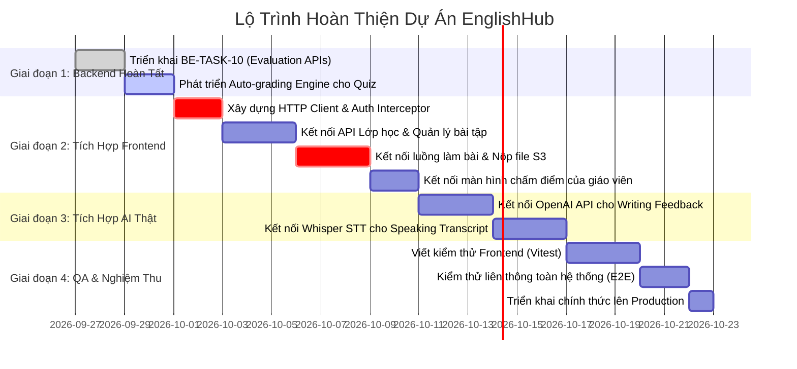

# Báo Cáo Phân Tích Khoảng Thiếu Kỹ Thuật So Với Tài Liệu Core & Lộ Trình Hoàn Thiện (Core Gap Analysis & Action Roadmap)

Tài liệu này đối chiếu toàn diện giữa **Bộ tài liệu kỹ thuật cốt lõi** (`docs/core/`: 00.PI, 01.SRS, 02.PP, 03.TP) với **Mã nguồn thực tế hiện hữu** của dự án **EnglishHub**, chỉ ra chi tiết những tính năng, module, API và kiểm thử còn thiếu (gaps), đồng thời đề xuất kế hoạch hành động cụ thể để hoàn thiện dự án.

---

## 1. Tóm Tắt Trạng Thái Dự Án (Executive Summary)

Dự án đã hoàn thành phần lớn nền tảng cốt lõi về cơ sở dữ liệu, kiến trúc Backend (DDD Hexagonal) và giao diện người dùng (UI), tuy nhiên vẫn tồn tại các khoảng thiếu quan trọng giữa thiết kế lý thuyết và mã nguồn chạy thực tế:

| Khối thành phần | Tỷ lệ hoàn thiện ước tính | Đánh giá hiện trạng | Điểm nghẽn chính cần giải quyết |
| :--- | :---: | :--- | :--- |
| **Cơ sở dữ liệu (Database)** | **95%** | Lược đồ V6 hoàn chỉnh với 17 bảng, scripts Flyway migrations từ V1 đến V6 đã được xác thực 100% trên PostgreSQL 16. | Cần bổ sung một số chỉ mục tối ưu cho truy vấn thống kê báo cáo lớn. |
| **Backend API (Spring Boot)** | **85%** | Đã hoàn thành 6/7 cụm API nghiệp vụ (Tài khoản, Lớp học, Giáo viên, Bài tập, Câu hỏi, Nộp bài, Chấm điểm, Lưu trữ S3). 286 automated tests chạy pass. | Đang chờ triển khai Cụm 7 (Student Evaluation APIs trong `BE-TASK-10`); Logic tự động tính điểm bài trắc nghiệm (Auto-grading engine). |
| **Tích hợp Trí tuệ nhân tạo (AI)** | **20%** | Đã dựng khung kiến trúc bất đồng bộ (`@Async("gradingAiExecutor")`), bảng lưu trữ transcript và feedback. | **Chưa tích hợp API LLM thật**: Lớp `GradingAiAnalysisServiceImpl` hiện tại mới là Stub rỗng, chưa kết nối OpenAI GPT / Whisper. |
| **Giao diện người dùng (Frontend)** | **70%** | Đã xây dựng đầy đủ các trang giao diện cho Admin, Teacher, Student bằng React 19, TypeScript và Vite. | **Chưa tích hợp API thật**: Toàn bộ hệ thống Frontend hiện đang chạy trên cơ chế Mock Auth (`localStorage.getItem('mockUser')`) và dữ liệu giả lập. |
| **Hạ tầng & Vận hành (DevOps)** | **90%** | Đã xây dựng 8 GitHub Actions pipelines, Docker Compose đa môi trường, mạng Tailscale Mesh VPN và quét bảo mật TruffleHog. | Cần nạp đầy đủ SSH secrets lên GitHub Repository để kích hoạt tự động deploy lên VPS Production. |
| **Đảm bảo chất lượng (QA & Test)** | **60%** | Backend đạt 286 tests (Unit + Testcontainers). | Frontend chưa có bộ kiểm thử tự động (Unit / Component / E2E). Chưa có kịch bản kiểm thử tải (Load Testing). |

---

## 2. Bảng Đối Chiếu 35+ Ca Sử Dụng (Use Cases Matrix: Core SRS vs. Hiện Trạng)

Dưới đây là bảng đối chiếu chi tiết toàn bộ các Ca sử dụng được định nghĩa tại Mục 2 của [`docs/core/01.SRS.md`](file:///d:/Codin/utc-code/HK4_1/Project1/EnglishHub/docs/core/01.SRS.md):

| STT | Tên Ca Sử Dụng (SRS) | Tác nhân | Backend API | Frontend UI | Trạng thái tích hợp | Khoảng thiếu kỹ thuật (Gap) & Cần làm |
| :---: | :--- | :---: | :---: | :---: | :---: | :--- |
| 1 | Đăng nhập | Admin, Teacher, Student | Hoàn thành | Hoàn thành | **Chưa tích hợp** | Frontend đang dùng `MOCK_ACCOUNTS`. Cần chuyển sang gọi `POST /api/v1/auth/login`, nhận JWT và lưu vào Secure Storage. |
| 2 | Đăng xuất | Admin, Teacher, Student | Hoàn thành | Hoàn thành | **Chưa tích hợp** | Cần gọi `POST /api/v1/auth/logout` để vô hiệu hóa Refresh Token trong database. |
| 3 | Quản lý tài khoản cá nhân | Mọi người dùng | Hoàn thành | Hoàn thành | **Chưa tích hợp** | Cần kết nối trang Profile với API lấy thông tin người dùng hiện tại và API đổi mật khẩu. |
| 4 | Quản lý tài khoản người dùng | Admin | Hoàn thành | Hoàn thành | **Chưa tích hợp** | Cần kết nối trang Accounts với cụm API User Management (kích hoạt, khóa tài khoản). |
| 5 | Phân quyền người dùng | Admin | Hoàn thành | Hoàn thành | **Chưa tích hợp** | Cần kết nối bảng phân quyền Role với danh sách quyền hạn thực tế. |
| 6 | Quản lý giáo viên | Admin | Hoàn thành | Hoàn thành | **Chưa tích hợp** | Cần kết nối trang Teachers với API CRUD Teacher Profile. |
| 7 | Quản lý học viên | Admin | Hoàn thành | Hoàn thành | **Chưa tích hợp** | Cần kết nối trang Students với API CRUD Student Profile. |
| 8 | Quản lý lớp học | Admin, Teacher | Hoàn thành | Hoàn thành | **Chưa tích hợp** | Cần kết nối trang Classes với API tạo, mở, đóng lớp và phân công giáo viên. |
| 9 | Quản lý thành viên lớp học | Admin, Teacher | Hoàn thành | Hoàn thành | **Chưa tích hợp** | Cần kết nối API thêm/xóa học sinh vào lớp (`POST/DELETE /classes/{id}/members`). |
| 10 | Xem danh sách lớp học | Teacher, Student | Hoàn thành | Hoàn thành | **Chưa tích hợp** | Cần gọi `GET /classes` có phân quyền theo token của giáo viên hoặc học sinh. |
| 11 | Quản lý bài tập (CRUD) | Teacher | Hoàn thành | Hoàn thành | **Chưa tích hợp** | Cần kết nối trang `TeacherAssignments` với API danh sách bài tập theo lớp. |
| 12 | Tạo bài tập đa kỹ năng | Teacher | Hoàn thành | Hoàn thành | **Chưa tích hợp** | Cần kết nối trang `TeacherCreateAssignment` với API tạo bài tập, tạo module và câu hỏi. |
| 13 | Mở bài tập (Publish) | Teacher | Hoàn thành | Hoàn thành | **Chưa tích hợp** | Cần kết nối nút bấm Mở bài với API chuyển trạng thái `DRAFT -> PUBLISHED`. |
| 14 | Khóa bài tập (Close) | Teacher | Hoàn thành | Hoàn thành | **Chưa tích hợp** | Cần kết nối nút Khóa bài với API chuyển trạng thái `PUBLISHED -> CLOSED`. |
| 15 | Xem danh sách bài tập | Student | Hoàn thành | Hoàn thành | **Chưa tích hợp** | Cần kết nối trang `StudentAssignments` để hiển thị bài tập lớp mình được giao. |
| 16 | Bắt đầu làm bài (Start Attempt) | Student | Hoàn thành | Chưa có | **Chưa làm** | Frontend cần gọi `POST /assignments/{id}/submissions` để khởi tạo phiên làm bài và nhận danh sách `submission_modules`. |
| 17 | Làm bài tập Viết (Writing) | Student | Hoàn thành | Hoàn thành UI | **Chưa tích hợp** | Cần nối trình soạn thảo với API lấy Presigned URL tài liệu hoặc nộp dạng đoạn văn ngắn. |
| 18 | Làm bài tập Nói (Speaking) | Student | Hoàn thành | Hoàn thành UI | **Chưa tích hợp** | Cần tích hợp luồng ghi âm: Ghi âm qua Web Audio API -> Lấy URL qua `POST /audio-upload-url` -> Tải file lên S3 -> Nộp bài. |
| 19 | Làm bài tập Đọc (Reading) | Student | Hoàn thành | Hoàn thành UI | **Chưa tích hợp** | Cần kết nối form trắc nghiệm/điền từ với API nộp phần thi `POST /submission-modules/{id}/submit`. |
| 20 | Làm bài tập Nghe (Listening) | Student | Hoàn thành | Hoàn thành UI | **Chưa tích hợp** | Cần phát âm thanh từ S3/URL và gửi đáp án qua API nộp phần thi. |
| 21 | Xem lại bài làm trước khi nộp | Student | Hoàn thành | Hoàn thành UI | **Chưa tích hợp** | Cần gọi API `GET /submission-modules/{id}` để hiển thị lại đáp án đã lưu trước khi nộp chính thức. |
| 22 | Nộp bài tập chính thức | Student | Hoàn thành | Hoàn thành UI | **Chưa tích hợp** | Cần gọi `POST /submissions/{id}/submit` để khóa toàn bộ bài làm và chuyển trạng thái sang `SUBMITTED`. |
| 23 | Quản lý lượt làm bài | Student | Hoàn thành | Hoàn thành UI | **Chưa tích hợp** | Backend đã chặn quá `max_submissions`. Frontend cần hiển thị số lượt còn lại. |
| 24 | Xem trạng thái bài làm | Student | Hoàn thành | Hoàn thành UI | **Chưa tích hợp** | Cần hiển thị đúng các trạng thái: `IN_PROGRESS`, `SUBMITTED`, `GRADED`. |
| 25 | Chấm bài thủ công | Teacher | Hoàn thành | Hoàn thành UI | **Chưa tích hợp** | Cần kết nối trang `TeacherSubmissionDetails` với API chấm điểm và nhận xét của giáo viên. |
| 26 | Hỗ trợ chấm chữa bằng AI | Teacher | **Chưa có (Stub)** | Giao diện tĩnh | **Thiếu cốt lõi** | Backend mới có service rỗng. Cần tích hợp OpenAI GPT-4o / Whisper để sinh nhận xét ngữ pháp, phát âm và transcript thật. |
| 27 | Tự động chấm bài Đọc/Nghe | Hệ thống | **Một phần** | Chưa có | **Thiếu logic** | Backend đã có cơ chế lưu đáp án, nhưng cần hoàn thiện service tự động so khớp `correct_answer` với `answers` để tính điểm ngay khi nộp. |
| 28 | Xem điểm số & Bài chữa | Student | Hoàn thành | Hoàn thành UI | **Chưa tích hợp** | Cần hiển thị kết quả từ API chấm điểm kèm các ghi chú sửa bài (Annotations). |
| 29 | Quản lý nhật ký điểm số | Teacher | Hoàn thành | Chưa có UI | **Thiếu Frontend** | Backend đã có API lịch sử sửa điểm (`grading_change_logs`), Frontend cần màn hình xem lịch sử thay đổi điểm. |
| 30 | Ghi chú chấm bài (Annotations) | Teacher | Hoàn thành | Chưa có UI | **Thiếu Frontend** | Backend đã có API CRUD Annotations. Frontend cần công cụ bôi đen đoạn văn để tạo ghi chú sửa lỗi. |
| 31 | Đánh giá học viên (Evaluations) | Teacher | **Chưa hoàn thành** | Chưa có | **Đang làm (BE-TASK-10)** | Backend đang chờ hoàn thành 5 endpoints (Cluster 7, APIs #58-#62). Frontend chưa có giao diện đánh giá định kỳ. |
| 32 | Xem báo cáo & Thống kê | Admin, Teacher | **Chưa có** | Giao diện mẫu | **Thiếu Backend** | Cần phát triển các endpoints tổng hợp: tỷ lệ nộp bài, điểm trung bình theo lớp, phân bố điểm kỹ năng. |

---

## 3. Chi Tiết Các Phần Còn Thiếu Theo Từng Phân Hệ

### 3.1. Phân hệ Trí tuệ Nhân tạo (AI Grading Engine) — Mức độ ưu tiên: CAO
- **Hiện trạng**: 
  - Đã có bảng `gradings` với các trường `ai_feedback`, `ai_transcript`, `ai_annotations`.
  - Đã có interface `GradingAiAnalysisService` và lớp `GradingAiAnalysisServiceImpl` được gắn nhãn `/** Stub until an AI provider is approved and integrated. */`.
- **Phần còn thiếu**:
  1. **Tích hợp API LLM thật**:
     - Chưa cấu hình client kết nối dịch vụ AI (OpenAI API / Azure OpenAI / Google Gemini API).
     - Chưa xây dựng bộ mẫu câu lệnh (Prompt Engineering Templates) chuẩn mực cho việc chấm bài viết (IELTS/CEFR: Task Response, Coherence, Lexical Resource, Grammatical Accuracy).
  2. **Tích hợp Speech-to-Text (STT)**:
     - Chưa có pipeline gọi OpenAI Whisper API để chuyển đổi tệp âm thanh Speaking thành văn bản (transcript) kèm dấu thời gian (timestamps).
  3. **Bộ phân tích phát âm**:
     - Chưa có logic phân tích độ trôi chảy (fluency) và lỗi phát âm tự động từ file âm thanh.
  4. **Quy trình xử lý bất đồng bộ an toàn**:
     - Cần hoàn thiện cơ chế hàng đợi xử lý nền (Task Queue / Retry Policy) để đảm bảo nếu AI API bị nghẽn mạng thì không gây lỗi cho hệ thống chính.

---

### 3.2. Phân hệ Tích Hợp Frontend với Backend API — Mức độ ưu tiên: RẤT CAO
- **Hiện trạng**:
  - Giao diện người dùng đã được thiết kế thẩm mỹ, bố cục chuyên nghiệp với React 19 và Tailwind/CSS.
  - Tuy nhiên, ứng dụng đang chạy độc lập 100% với dữ liệu mẫu trong `localStorage` (`mockUser`, `MOCK_ACCOUNTS`).
- **Phần còn thiếu**:
  1. **Tầng dịch vụ mạng (API Client Layer)**:
     - Chưa có tệp cấu hình Axios/Fetch instance với `baseURL: http://localhost:8080/api/v1`.
     - Chưa có Request Interceptor tự động gắn `Authorization: Bearer <jwt_token>`.
     - Chưa có Response Interceptor tự động xử lý khi mã lỗi `401 Unauthorized` xuất hiện (gọi API refresh token bằng `refresh_token` hoặc điều hướng về trang đăng nhập).
  2. **Chuyển đổi đăng nhập thật**:
     - Xóa bỏ `MOCK_ACCOUNTS` trong [Login.tsx](file:///d:/Codin/utc-code/HK4_1/Project1/EnglishHub/frontend/src/pages/Login.tsx), kết nối trực tiếp với endpoint `POST /api/v1/auth/login`.
  3. **Kết nối các màn hình nghiệp vụ với dữ liệu thật**:
     - Kết nối màn hình Lớp học (`StudentClasses`, `TeacherClasses`, `Classes`) với API `/api/v1/classes`.
     - Kết nối màn hình Quản lý bài tập (`TeacherAssignments`, `TeacherCreateAssignment`) với API `/api/v1/assignments`.
     - Kết nối luồng làm bài và xem kết quả của học sinh với API `/api/v1/submissions`.

---

### 3.3. Phân hệ Nộp Tệp Ghi Âm & Bài Luận Lên S3 Trên Frontend — Mức độ ưu tiên: CAO
- **Hiện trạng**:
  - Backend đã hoàn tất trọn vẹn lớp S3 Storage Service, hỗ trợ sinh Presigned PUT URL và kiểm tra tệp với MinIO Testcontainers (`BE-TASK-6`).
- **Phần còn thiếu trên Frontend**:
  1. **Hook ghi âm trực tiếp (`useAudioRecorder`)**:
     - Chưa có logic sử dụng Web Audio API / `MediaRecorder` để ghi âm giọng nói của học sinh trên trình duyệt, xuất ra định dạng `.webm` hoặc `.wav`.
  2. **Quy trình nộp bài 3 bước trên giao diện**:
     - Bước 1: Gọi API `POST /api/v1/submission-modules/{id}/audio-upload-url` để nhận `uploadUrl` và `storageKey`.
     - Bước 2: Dùng lệnh `fetch(uploadUrl, { method: 'PUT', body: audioBlob })` để tải file thẳng lên S3/R2 mà không qua server backend.
     - Bước 3: Sau khi PUT thành công, gọi `POST /api/v1/submission-modules/{id}/submit` với thân rỗng `{}` để backend chốt nộp bài.

---

### 3.4. Phân hệ Tự Động Chấm Điểm (Auto-Grading Engine) — Mức độ ưu tiên: TRUNG BÌNH
- **Hiện trạng**:
  - Khi học sinh nộp phần thi trắc nghiệm (QUIZ) hoặc viết lại câu (REWRITE), backend đã lưu câu trả lời vào bảng `answers`.
  - Bản ghi `gradings` được khởi tạo ở trạng thái `PENDING` với `finalScore = null`.
- **Phần còn thiếu**:
  1. **Bộ tự động chấm trắc nghiệm & điền từ**:
     - Cần có service tự động đọc đáp án đúng từ `questions.correct_answer` (dạng JSON), so khớp với `answers.content` để tính điểm số đạt được, cập nhật trạng thái grading từ `PENDING` sang `GRADED` ngay khi bài thi hoàn tất.

---

### 3.5. Phân hệ Đánh Giá Học Viên (Student Evaluation APIs) — Mức độ ưu tiên: TRUNG BÌNH
- **Hiện trạng**:
  - Bảng cơ sở dữ liệu `student_evaluations` đã sẵn sàng trong Flyway migration V1.
  - Task [BE-TASK-10](file:///d:/Codin/utc-code/HK4_1/Project1/EnglishHub/.agents/tasks/be-primary/active/BE-TASK-10.yaml) đang nằm trong thư mục `active/` chờ triển khai.
- **Phần còn thiếu**:
  - Cụm 5 endpoints theo tài liệu thiết kế API:
    - `GET /api/v1/students/{studentId}/evaluations`: Lấy danh sách đánh giá của học sinh.
    - `POST /api/v1/students/{studentId}/evaluations`: Giáo viên tạo đánh giá mới cho học sinh thuộc lớp phụ trách.
    - `GET /api/v1/evaluations/{id}`: Xem chi tiết một bản đánh giá.
    - `PUT /api/v1/evaluations/{id}`: Tác giả cập nhật nội dung đánh giá.
    - `DELETE /api/v1/evaluations/{id}`: Tác giả xóa bản đánh giá.
  - Giao diện người dùng trên Frontend cho phép giáo viên viết đánh giá định kỳ và học sinh xem nhận xét của giáo viên.

---

### 3.6. Phân hệ Báo Cáo & Thống Kê Tổng Hợp (Analytics & Reporting) — Mức độ ưu tiên: THẤP
- **Hiện trạng**:
  - Frontend có các trang demo `StudentAnalytics`, `TeacherClassProgress`.
- **Phần còn thiếu**:
  - Chưa có các endpoints chuyên trách phía Backend phục vụ vẽ biểu đồ:
    - Thống kê tỷ lệ nộp bài theo từng bài tập (đã nộp, nộp muộn, chưa nộp).
    - Biểu đồ phân bổ điểm số trung bình của lớp học.
    - Biểu đồ radar đánh giá năng lực của học sinh trên 4 kỹ năng Nghe - Nói - Đọc - Viết.

---

### 3.7. Đảm Bảo Chất Lượng Phía Frontend (Frontend QA) — Mức độ ưu tiên: TRUNG BÌNH
- **Hiện trạng**:
  - Backend đã đạt chuẩn kiểm thử tự động với 286 automated tests chạy pass 100%.
- **Phần còn thiếu**:
  - Frontend hoàn toàn chưa có tệp kiểm thử tự động nào (`.test.tsx` hoặc `.spec.tsx`).
  - Cần bổ sung **Vitest** và **React Testing Library** để kiểm thử các thành phần then chốt: Form đăng nhập, Bộ đếm giờ làm bài, Logic chuyển đổi câu hỏi trắc nghiệm và Xử lý lỗi kết nối mạng.

---

## 4. Lộ Trình Hành Động Đề Xuất (Gap Closure Roadmap)

Để đưa dự án từ trạng thái hiện tại tiến tới hoàn thiện 100% đúng theo đặc tả Core, lộ trình hành động được phân kỳ thành 4 giai đoạn cụ thể:

### Chi tiết các công việc cần làm:

#### Giai đoạn 1: Hoàn tất 100% Backend Cốt lõi (Dự kiến: 4 ngày)
1. `@be-primary`: Triển khai và bàn giao [BE-TASK-10](file:///d:/Codin/utc-code/HK4_1/Project1/EnglishHub/.agents/tasks/be-primary/active/BE-TASK-10.yaml) (Student Evaluation APIs #58-#62), kèm unit/integration test.
2. `@be-secondary`: Xây dựng service tự động chấm bài trắc nghiệm (Multiple Choice & Short Answer Auto-grading) để chuyển trạng thái grading sang `GRADED` ngay khi học sinh nộp bài.

#### Giai đoạn 2: Tích hợp Toàn diện Frontend với Backend API (Dự kiến: 10 ngày)
1. `@fe-primary`: Tạo thư mục `frontend/src/services/` với Axios client, gắn JWT Token tự động vào header.
2. Xóa bỏ Mock Auth, thay bằng flow đăng nhập thật gọi tới `POST /api/v1/auth/login`.
3. Tích hợp màn hình làm bài của học sinh với backend: gọi bắt đầu làm bài (`/submissions`), nộp câu trả lời (`/submission-modules/{id}/submit`) và nộp bài chính thức.
4. Hiện thực hook tải tệp âm thanh và tài liệu lên S3 qua Presigned PUT URL.
5. Kết nối màn hình chấm bài của giáo viên (`TeacherSubmissionDetails`) để hiển thị bài làm thật, file ghi âm thật và gửi điểm/nhận xét về backend.

#### Giai đoạn 3: Kết nối Trí tuệ Nhân tạo (AI Engine Thật) (Dự kiến: 6 ngày)
1. Cấu hình biến môi trường `OPENAI_API_KEY` (hoặc Gemini API Key) an toàn trên server.
2. Thay thế `GradingAiAnalysisServiceImpl` bằng service gọi API thật:
   - Với Writing: Gửi đề bài và bài luận tới GPT-4o để sinh phản hồi theo 4 tiêu chí IELTS/CEFR kèm các đoạn ghi chú sửa lỗi (`ai_annotations`).
   - Với Speaking: Gửi file audio tới Whisper API để sinh bản phiên âm (`ai_transcript`) và phân tích độ trôi chảy.

#### Giai đoạn 4: Đảm bảo Chất lượng, E2E Testing & Phát hành (Dự kiến: 6 ngày)
1. `@tester`: Viết kịch bản kiểm thử tích hợp liên thông End-to-End từ tài khoản Giáo viên tạo bài tập -> Học sinh làm bài và nộp audio -> AI phân tích -> Giáo viên chấm điểm và trả bài.
2. Thiết lập bộ kiểm thử tự động cho Frontend với Vitest.
3. `@devops`: Cấu hình đầy đủ SSH Secrets trên GitHub Actions Repository để tự động deploy bản phát hành chính thức lên VPS Production.
