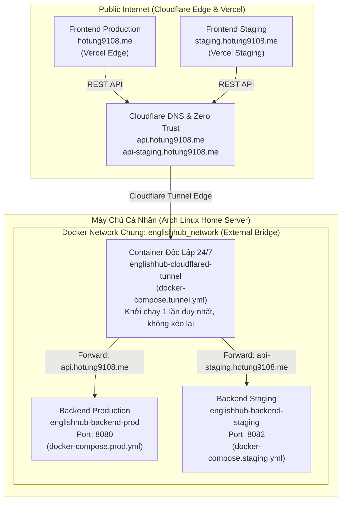

# Kế Hoạch Tái Cấu Trúc Docker Compose (Prod / Staging), Tách Cloudflare Tunnel Độc Lập & Khắc Phục CI/CD

> **Dự án**: EnglishHub  
> **Tài liệu**: Phương án tái cấu trúc hệ thống triển khai Docker Compose & Cloudflare Tunnel Ingress  
> **Trạng thái**: Đã phê duyệt đề xuất / Đã cập nhật phân tích log Dockerd thực tế  

---

## 1. Giải Mã Log Docker Thực Tế & Phân Tích Hiện Trạng

### 1.1. Phân tích chi tiết log `dockerd` từ máy chủ Arch Linux của bạn

Từ đoạn log bạn cung cấp:
```text
Oct 03 22:23:25 archlinux dockerd[1894]: level=error msg="failed to cleanup \"extract-971005607-YSFy sha256:...\"" error="NotFound: snapshot ... does not exist: not found"
Oct 03 22:23:27 archlinux dockerd[1894]: level=info msg="fetch failed" error="failed to do request: Head \"https://registry-1.docker.io/v2/cloudflare/cloudflared/manifests/latest\": context canceled"
Oct 03 22:23:27 archlinux dockerd[1894]: level=info msg="request cancelled by client" error="failed to resolve reference \"docker.io/cloudflare/cloudflared:latest\": failed to do request: Head \"https://registry-1.docker.io/v2/cloudflare/cloudflared/manifests/latest\": context canceled" status=499
Oct 03 22:23:27 archlinux dockerd[1894]: level=error msg="failed to cleanup \"extract-468848390-0K9L sha256:...\"" error="NotFound: snapshot ... does not exist: not found"
```

#### Nguyên nhân trực tiếp của lỗi:
1. **Lỗi `status=499` và `context canceled`**:
   - `HTTP Status 499` nghĩa là **"Client Closed Request"** (Phía client/lệnh gọi chủ động ngắt kết nối trước khi server phản hồi).
   - Ở đây, dockerd đang gửi request kiểm tra manifest của `cloudflare/cloudflared:latest` tới Docker Hub (`registry-1.docker.io`).
   - Kết nối tới Docker Hub từ mạng Việt Nam rất hay bị nghẽn, bóp băng thông hoặc timeout. Quá trình kiểm tra/tải bị treo quá lâu khiến phiên lệnh (do timeout của lệnh SSH GitHub Actions hoặc do người dùng nhấn `Ctrl + C`) bị hủy ngang (`context canceled`).
2. **Lỗi snapshotter containerd `failed to cleanup snapshot ... does not exist: not found`**:
   - Khi Docker đang giải nén layer image mà tiến trình bị dừng đột ngột (do `context canceled` ở trên), cơ chế quản lý snapshot của containerd/overlay2 bị mồ côi (orphaned leases), sinh ra các dòng lỗi `failed to cleanup`.
3. **Tại sao deploy Backend lại đi kéo `cloudflare/cloudflared:latest` từ Docker Hub?**:
   - Nhìn vào file `.github/workflows/cd-backend.yml` (dòng 73) và `cd-backend-development.yml` (dòng 73):
     ```bash
     docker compose -f docker-compose.prod.yml --profile cloudflare up -d --pull always
     ```
   - Cờ `--pull always` bắt buộc Docker compose **mỗi lần deploy backend đều phải gọi lên Docker Hub để kiểm tra và kéo lại toàn bộ image trong compose file**, trong đó có cả `cloudflare/cloudflared:latest`!
   - Đây chính là bằng chứng xác thực 100%: **Việc gộp chung container Cloudflare Tunnel vào compose của backend là sai lầm nghiêm trọng!** Mỗi lần deploy code mới cho Spring Boot, toàn bộ hệ thống lại bị treo cứng do cố kéo lại `cloudflared` từ Docker Hub.

---

### 1.2. Tên miền mới trong Cloudflare Tunnel liệu đã được config chưa hay vẫn random?

#### Bản chất cơ chế Cloudflare Tunnel
- **Tên miền bị random (dạng `*.trycloudflare.com`)**: Chỉ xảy ra khi bạn chạy chế độ dùng thử tạm thời (Quick Tunnel) bằng lệnh `cloudflared tunnel --url http://localhost:8080`. Chế độ này không cần đăng nhập hay token, mỗi lần tắt đi bật lại sẽ tự sinh một subdomain ngẫu nhiên khác nhau.
- **Dự án EnglishHub sử dụng chế độ nào?**:
  Trong file `docker-compose.prod.yml`, cấu hình container sử dụng:
  ```yaml
  command: tunnel run
  environment:
    TUNNEL_TOKEN: ${CLOUDFLARE_TUNNEL_TOKEN:-}
  ```
  Đây là **Named Tunnel (Tunnel định danh cố định)** của Cloudflare Zero Trust. Cơ chế này **KHÔNG BAO GIỜ BỊ RANDOM TÊN MIỀN** mà luôn gắn chặt với tên miền riêng của bạn.

#### Tên miền đã thực sự hoạt động chưa?
- **Trong mã nguồn và tài liệu**: Bản quy hoạch tên miền đã được chốt:
  - `api.hotung9108.me` ➔ Cổng `8080` (Backend Production)
  - `api-staging.hotung9108.me` ➔ Cổng `8082` (Backend Staging)
  - `hotung9108.me` hoặc `app.hotung9108.me` ➔ Vercel Production
  - `staging.hotung9108.me` ➔ Vercel Staging
- **Thực tế hệ thống**: Cấu hình Ingress Hostname của Named Tunnel được lưu trực tiếp trên **Cloudflare Zero Trust Dashboard** (Cloud-managed), không nằm trong code Git:
  - Nếu trên Cloudflare Dashboard bạn **chưa tạo Tunnel** hoặc **chưa thêm 2 Public Hostname** trên, Cloudflare sẽ chưa biết định tuyến về máy tính của bạn.
  - Nếu trên máy chủ chưa điền mã bí mật `CLOUDFLARE_TUNNEL_TOKEN` vào file `.env`, container `cloudflared` sẽ lập tức crash khi khởi động (exit code 1).

---

### 1.3. Tổng hợp 4 nguyên nhân khiến quy trình deploy bị gãy hoàn toàn

1. **Gộp Tunnel vào Backend Compose + Cờ `--pull always` (Nguyên nhân trực tiếp trong log của bạn)**: Khiến mọi lần deploy Backend đều bị nghẽn ở bước kéo image `cloudflare/cloudflared:latest` từ Docker Hub, dẫn tới timeout `status=499` và hỏng snapshot layer.
2. **Xung đột tên container giữa Prod và Staging**: Cả 2 workflow CI/CD (`cd-backend.yml` và `cd-backend-development.yml`) đều đang gọi chung `docker-compose.prod.yml` với tên gán cứng `container_name: englishhub-backend-prod`. Khi deploy Staging, Docker lập tức báo lỗi xung đột tên container và dừng lại.
3. **Đè Image Tag giữa Staging và Production**: `cd-backend-development.yml` đang build và push image lên `ghcr.io/hotung9108/english-hub-backend:latest`, làm code Staging đè lên tag `latest` của Prod.
4. **Workflow rác và lỗi trigger Vercel**: Workflow cũ `cd-deploy.yml` chạy ngầm khi push vào `main` và cố SSH bằng `SERVER_SSH_KEY` vào `/opt/englishhub` (gây báo lỗi đỏ). Các workflow frontend thì trigger `pull_request` thay vì `push`.

---

## 2. Kiến Trúc Hạ Tầng Mục Tiêu (Target Architecture)



---

## 3. Quy Hoạch & Thiết Kế File Chi Tiết

### 3.1. File `docker-compose.tunnel.yml` (Khởi chạy độc lập 24/7)
File này tách biệt hoàn toàn với mã nguồn backend, đặt ở thư mục riêng (ví dụ `~/englishhub-tunnel`) và chỉ chạy 1 lần duy nhất:

```yaml
services:
  tunnel:
    image: cloudflare/cloudflared:latest
    container_name: englishhub-cloudflared-tunnel
    restart: unless-stopped
    command: tunnel run
    environment:
      TUNNEL_TOKEN: ${CLOUDFLARE_TUNNEL_TOKEN:?Cloudflare Tunnel Token is required}
    networks:
      - englishhub_network

networks:
  englishhub_network:
    name: englishhub_network
    external: true
```

*File cấu hình mẫu `env.tunnel.example`:*
```env
# Token lấy từ Cloudflare Zero Trust Dashboard -> Networks -> Tunnels
CLOUDFLARE_TUNNEL_TOKEN=eyJhIjoi...
```

---

### 3.2. File `docker-compose.prod.yml` (Backend Production - Đã loại bỏ Tunnel)
Loại bỏ hoàn toàn service tunnel. Chỉ quản lý backend prod:

```yaml
services:
  backend:
    image: ${BACKEND_IMAGE:-ghcr.io/hotung9108/english-hub-backend:latest}
    container_name: englishhub-backend-prod
    restart: unless-stopped
    ports:
      - "${BACKEND_PORT:-8080}:8080"
    environment:
      SPRING_PROFILES_ACTIVE: prod
      SPRING_DATASOURCE_URL: ${DB_URL:?Database connection URL (DB_URL) is required}
      SPRING_DATASOURCE_USERNAME: ${DB_USER:?Database username (DB_USER) is required}
      SPRING_DATASOURCE_PASSWORD: ${DB_PASSWORD:?Database password (DB_PASSWORD) is required}
      JWT_SECRET: ${JWT_SECRET:?JWT secret key is required}
      CORS_ALLOWED_ORIGINS: ${CORS_ALLOWED_ORIGINS:-https://hotung9108.me,https://app.hotung9108.me,https://api.hotung9108.me}
      OPENAI_API_KEY: ${OPENAI_API_KEY:-}
      JAVA_TOOL_OPTIONS: "${JAVA_TOOL_OPTIONS:--Xms256m -Xmx768m}"
      STORAGE_S3_ENABLED: ${STORAGE_S3_ENABLED:-true}
      STORAGE_S3_ENDPOINT: ${STORAGE_S3_ENDPOINT:-}
      STORAGE_S3_REGION: ${STORAGE_S3_REGION:-}
      STORAGE_S3_ACCESS_KEY_ID: ${STORAGE_S3_ACCESS_KEY_ID:-}
      STORAGE_S3_SECRET_ACCESS_KEY: ${STORAGE_S3_SECRET_ACCESS_KEY:-}
      STORAGE_S3_BUCKET: ${STORAGE_S3_BUCKET:-}
      STORAGE_S3_PATH_STYLE: ${STORAGE_S3_PATH_STYLE:-true}
    networks:
      - englishhub_network
    healthcheck:
      test: ["CMD-SHELL", "wget -q -O - http://localhost:8080/actuator/health > /dev/null || exit 1"]
      interval: 15s
      timeout: 5s
      retries: 5
      start_period: 25s

networks:
  englishhub_network:
    name: englishhub_network
    external: true
```

---

### 3.3. File `docker-compose.staging.yml` (Backend Staging Độc Lập)
Tách biệt toàn bộ tên container, cổng ngoài và profile:

```yaml
services:
  backend-staging:
    image: ${BACKEND_IMAGE:-ghcr.io/hotung9108/english-hub-backend:staging-latest}
    container_name: englishhub-backend-staging
    restart: unless-stopped
    ports:
      - "${BACKEND_PORT:-8082}:8080"
    environment:
      SPRING_PROFILES_ACTIVE: staging
      SPRING_DATASOURCE_URL: ${DB_URL:?Database connection URL (DB_URL) is required}
      SPRING_DATASOURCE_USERNAME: ${DB_USER:?Database username (DB_USER) is required}
      SPRING_DATASOURCE_PASSWORD: ${DB_PASSWORD:?Database password (DB_PASSWORD) is required}
      JWT_SECRET: ${JWT_SECRET:?JWT secret key is required}
      CORS_ALLOWED_ORIGINS: ${CORS_ALLOWED_ORIGINS:-https://staging.hotung9108.me,https://api-staging.hotung9108.me}
      OPENAI_API_KEY: ${OPENAI_API_KEY:-}
      JAVA_TOOL_OPTIONS: "${JAVA_TOOL_OPTIONS:--Xms256m -Xmx512m}"
      STORAGE_S3_ENABLED: ${STORAGE_S3_ENABLED:-true}
      STORAGE_S3_ENDPOINT: ${STORAGE_S3_ENDPOINT:-}
      STORAGE_S3_REGION: ${STORAGE_S3_REGION:-}
      STORAGE_S3_ACCESS_KEY_ID: ${STORAGE_S3_ACCESS_KEY_ID:-}
      STORAGE_S3_SECRET_ACCESS_KEY: ${STORAGE_S3_SECRET_ACCESS_KEY:-}
      STORAGE_S3_BUCKET: ${STORAGE_S3_BUCKET:-}
      STORAGE_S3_PATH_STYLE: ${STORAGE_S3_PATH_STYLE:-true}
    networks:
      - englishhub_network
    healthcheck:
      test: ["CMD-SHELL", "wget -q -O - http://localhost:8080/actuator/health > /dev/null || exit 1"]
      interval: 15s
      timeout: 5s
      retries: 5
      start_period: 25s

networks:
  englishhub_network:
    name: englishhub_network
    external: true
```

*File cấu hình mẫu `env.staging.example`:*
```env
BACKEND_IMAGE=ghcr.io/hotung9108/english-hub-backend:staging-latest
BACKEND_PORT=8082
DB_URL=jdbc:postgresql://ep-xyz.ap-southeast-1.aws.neon.tech/neondb_staging?sslmode=require
DB_USER=neondb_owner
DB_PASSWORD=your_neon_staging_password
JWT_SECRET=your-staging-secret-jwt-key-minimum-32-chars
CORS_ALLOWED_ORIGINS=https://staging.hotung9108.me,https://api-staging.hotung9108.me
```

---

### 3.4. Chuẩn Hóa Các GitHub Actions Workflows (Bỏ hoàn toàn `--pull always`)

#### 1. Xóa workflow thừa `.github/workflows/cd-deploy.yml` [DELETE]
- Loại bỏ để tránh xung đột SSH key và thư mục deploy `/opt/englishhub`.

#### 2. Cập nhật `.github/workflows/cd-backend.yml` (Production) [MODIFY]
- Chỉ pull đúng image SHA từ GHCR (`docker pull $IMAGE_NAME:$GITHUB_SHA`).
- Bỏ cờ `--pull always` và bỏ profile `--profile cloudflare`!
  ```bash
  cd /home/${{ secrets.SERVER_USER }}/englishhub
  sed -i "s|BACKEND_IMAGE=.*|BACKEND_IMAGE=$IMAGE_NAME:$GITHUB_SHA|" .env
  docker network create englishhub_network 2>/dev/null || true
  # Deploy backend prod - không đụng tới tunnel và không kéo Docker Hub thừa
  docker compose -f docker-compose.prod.yml up -d
  docker image prune -f
  ```

#### 3. Cập nhật `.github/workflows/cd-backend-development.yml` (Staging) [MODIFY]
- Push tag riêng: `staging-latest` và `staging-${{ github.sha }}`.
- Sửa lệnh deploy trỏ vào `docker-compose.staging.yml`:
  ```bash
  cd /home/${{ secrets.SERVER_USER }}/englishhub-dev
  sed -i "s|BACKEND_IMAGE=.*|BACKEND_IMAGE=$IMAGE_NAME:staging-$GITHUB_SHA|" .env
  docker network create englishhub_network 2>/dev/null || true
  docker compose -f docker-compose.staging.yml up -d
  docker image prune -f
  ```

#### 4. Cập nhật `.github/workflows/cd-frontend.yml` & `cd-frontend-development.yml` [MODIFY]
- Đổi trigger từ `pull_request` sang `on: push: branches: [main]` và `on: push: branches: [staging]`.

---

## 4. Hướng Dẫn Khắc Phục Lỗi Snapshot Trên Máy Chủ Arch Linux & Thiết Lập

### Bước 1: Xử lý rác containerd / snapshot dở dang trên Arch Linux
Chạy lệnh dọn dẹp các layer rác do tiến trình pull bị hủy dở dang:
```bash
# Dọn dẹp snapshot và image dangling
docker system prune -a --volumes -f
```

### Bước 2: Tạo Docker Network chung
```bash
docker network create englishhub_network
```

### Bước 3: Khởi chạy Cloudflare Tunnel độc lập 24/7
1. Lấy token từ Cloudflare Zero Trust Dashboard -> Tunnels.
2. Thêm 2 bản ghi Public Hostnames:
   - `api.hotung9108.me` ➔ `http://englishhub-backend-prod:8080` (hoặc `http://localhost:8080`)
   - `api-staging.hotung9108.me` ➔ `http://englishhub-backend-staging:8080` (hoặc `http://localhost:8082`)
3. Khởi chạy container:
   ```bash
   mkdir -p ~/englishhub-tunnel
   cd ~/englishhub-tunnel
   echo "CLOUDFLARE_TUNNEL_TOKEN=eyJhIjoi..." > .env
   # Đặt file docker-compose.tunnel.yml tại đây
   docker compose -f docker-compose.tunnel.yml up -d
   ```
   *Lưu ý: Chỉ cần chạy lệnh này một lần, container sẽ tự khởi động lại cùng máy chủ (`restart: unless-stopped`).*

---

## 5. Checklist Nghiệm Thu (Verification)

- [ ] Lệnh `docker compose config` hợp lệ trên cả 3 file compose.
- [ ] Container `englishhub-cloudflared-tunnel` chạy `Up` ổn định, không bị khởi động lại khi backend deploy.
- [ ] Backend Prod và Staging cùng chạy đồng thời mà không bị lỗi xung đột container name hay port.
- [ ] Pipeline CI/CD GitHub Actions chạy mượt mà, không bị văng lỗi `status=499` hay `context canceled`.
