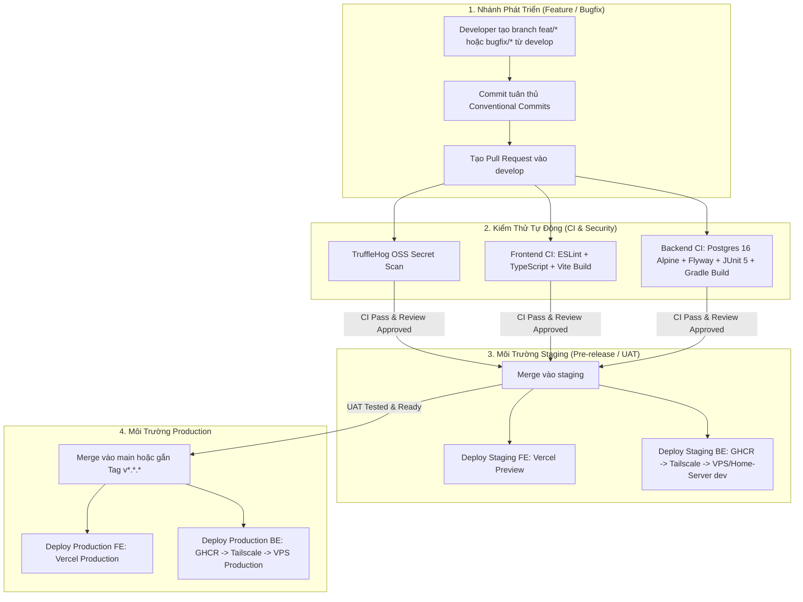

# Hướng Dẫn Chi Tiết GitHub Workflow & CI/CD Pipeline - EnglishHub

Tài liệu này mô tả toàn diện về **Git Flow**, quy chuẩn commit, quy trình kiểm thử tự động (**CI**), quét bảo mật (**Security Scan**) và quy trình triển khai tự động (**CD**) đang vận hành trên GitHub Actions của dự án **EnglishHub**.

---

## 1. Tổng Quan Kiến Trúc Git & CI/CD Workflow

Hệ thống CI/CD của EnglishHub phân tách rõ ràng giữa 3 tầng môi trường: **Development**, **Staging**, và **Production**.



---

## 2. Chiến Lược Phân Nhánh (Branching Strategy)

Dự án áp dụng mô hình biến thể từ **Git Flow**:

| Tên nhánh | Mục đích sử dụng | Quy tắc truy cập & Tác động |
| :--- | :--- | :--- |
| **`main`** | **Production-ready**: Mã nguồn chính thức đang chạy trên môi trường người dùng cuối. | - Không push trực tiếp.<br>- Phải thông qua PR từ `staging` hoặc hotfix.<br>- Kích hoạt deploy Backend Production và Vercel Production. |
| **`staging`** | **Pre-release / UAT**: Môi trường tích hợp phục vụ kiểm thử hệ thống trước khi release. | - Nhận code từ `develop` sau khi đã hoàn thành một đợt tính năng.<br>- Kích hoạt deploy Backend Dev (Home-Server) và Vercel Dev. |
| **`develop`** | **Integration branch**: Nhánh tích hợp cho toàn bộ quá trình phát triển thường nhật. | - Mọi nhánh `feature/*` và `bugfix/*` đều merge vào đây.<br>- Chạy toàn bộ kiểm thử CI backend, CI frontend và quét bí mật. |
| **`feat/*`** hoặc **`feature/*`** | Phát triển tính năng mới (ví dụ: `feat/submissions-answers-api`). | Rẽ nhánh từ `develop`. Sau khi hoàn thành tạo PR vào `develop`. |
| **`bugfix/*`** hoặc **`fix/*`** | Sửa lỗi nghiệp vụ trong quá trình phát triển hoặc kiểm thử. | Rẽ nhánh từ `develop`. |
| **`hotfix/*`** | Sửa lỗi khẩn cấp trực tiếp trên môi trường Production. | Rẽ nhánh từ `main`. Sau khi sửa xong phải merge đồng thời vào cả `main` và `develop`. |

---

## 3. Quy Ước Commit (Conventional Commits)

Mọi commit bắt buộc phải theo chuẩn:
```text
<type>(<scope>): <mô tả ngắn bằng tiếng Anh hoặc tiếng Việt>
```

### Các kiểu commit (`type`):
- `feat`: Tính năng mới (ví dụ: `feat(submission): add audio recording upload`)
- `fix`: Sửa lỗi (ví dụ: `fix(auth): handle jwt token expiration`)
- `refactor`: Tái cấu trúc mã nguồn không làm đổi logic (ví dụ: `refactor(backend): modularize grading domain service`)
- `test`: Viết thêm hoặc chỉnh sửa unit/integration tests (ví dụ: `test(grading): add testcontainers for localstack`)
- `docs`: Chỉnh sửa hoặc bổ sung tài liệu (ví dụ: `docs(api): update chapter 6 submission contracts`)
- `chore`: Tác vụ bảo trì, nâng cấp dependencies, config (ví dụ: `chore(deps): update vite to v6`)
- `ci`: Chỉnh sửa cấu hình CI/CD GitHub Actions (ví dụ: `ci(backend): add gradle caching step`)
- `perf`: Cải thiện hiệu năng (ví dụ: `perf(query): optimize assignment submission fetch`)

---

## 4. Danh Sách GitHub Actions Workflows Hiện Tại

Hệ thống workflow nằm trong thư mục [`.github/workflows/`](file:///d:/Codin/utc-code/HK4_1/Project1/EnglishHub/.github/workflows):

### 4.1. Nhóm Đảm Bảo Chất Lượng & Bảo Mật (CI & Quality Gates)

#### 1. Quét Rò Rỉ Bí Mật: [`security-scan.yml`](file:///d:/Codin/utc-code/HK4_1/Project1/EnglishHub/.github/workflows/security-scan.yml)
- **Tên workflow**: `Security & Secret Scan`
- **Trigger**:
  - `push` và `pull_request` vào `main`, `staging`, `develop`.
- **Cơ chế hoạt động**:
  - Tải toàn bộ lịch sử git (`fetch-depth: 0`).
  - Dùng **TruffleHog OSS** kiểm tra các secret đã bị lộ (OpenAI API key, AWS S3 Credentials, JWT Private Keys, Database Passwords,...).
  - Sử dụng cờ `--only-verified` để tránh báo lỗi giả trên các file `.example` hoặc mock token.
  - Tự động hủy job cũ nếu có commit mới (`cancel-in-progress: true`).

#### 2. Kiểm Thử & Đóng Gói Backend: [`ci-backend.yml`](file:///d:/Codin/utc-code/HK4_1/Project1/EnglishHub/.github/workflows/ci-backend.yml)
- **Tên workflow**: `Backend CI`
- **Trigger**:
  - `push` hoặc `pull_request` vào `main`, `staging`, `develop` khi có thay đổi trong `backend/**` hoặc `.github/workflows/ci-backend.yml`.
- **Môi trường & Công cụ**:
  - Runner: `ubuntu-latest`.
  - Service container: `postgres:16-alpine` chạy cổng `5432` với healthcheck tự động.
  - JDK: Eclipse Temurin Java 21.
  - Gradle Caching: Lưu cache thư mục `~/.gradle/caches` và `~/.gradle/wrapper` dựa theo mã băm của file build gradle.
- **Các bước thực thi**:
  1. Cấp quyền thực thi cho Gradle Wrapper (`chmod +x gradlew`).
  2. Kéo trước Docker image cho Testcontainers (`localstack/localstack:3`, `postgres:16-alpine`).
  3. **Xác thực Flyway Migrations & Chạy Test**: Thực thi `./gradlew test --no-daemon` kết nối với PostgreSQL test database để kiểm tra toàn bộ script SQL migration và Unit/Integration Tests.
  4. **Kiểm tra đóng gói**: Biên dịch JAR bằng `./gradlew bootJar -x test --no-daemon`.

#### 3. Kiểm Tra Cú Pháp & Đóng Gói Frontend: [`ci-frontend.yml`](file:///d:/Codin/utc-code/HK4_1/Project1/EnglishHub/.github/workflows/ci-frontend.yml)
- **Tên workflow**: `Frontend CI`
- **Trigger**:
  - `push` hoặc `pull_request` vào `main`, `staging`, `develop` khi có thay đổi trong `frontend/**` hoặc `.github/workflows/ci-frontend.yml`.
- **Môi trường & Công cụ**:
  - Runner: `ubuntu-latest`.
  - Node.js: Phiên bản 22 với cache npm tự động qua `frontend/package-lock.json`.
- **Các bước thực thi**:
  1. Cài đặt dependencies nguyên bản: `npm ci`.
  2. Chạy linter: `npm run lint` (ESLint).
  3. Kiểm tra kiểu TypeScript và build production bundle: `npm run build` (Vite).

---

### 4.2. Nhóm Triển Khai Staging (Staging CD)

#### 4. Triển Khai Frontend Staging Lên Vercel: [`cd-frontend-development.yml`](file:///d:/Codin/utc-code/HK4_1/Project1/EnglishHub/.github/workflows/cd-frontend-development.yml)
- **Tên workflow**: `Deploy staging Frontend to Vercel`
- **Trigger**: `pull_request` mở vào nhánh `staging`.
- **Các bước thực thi**:
  1. Kiểm tra lint (`npm run lint`) và unit tests (`npm run test --if-present`).
  2. Cài đặt Vercel CLI toàn cục.
  3. Kéo cấu hình môi trường staging từ Vercel bằng `VERCEL_TOKEN`, `VERCEL_ORG_ID_DEV`, `VERCEL_PROJECT_ID_DEV`.
  4. Thực hiện `vercel build --prod` trực tiếp trên GitHub runner.
  5. Triển khai bản prebuilt lên Vercel (`vercel deploy --prebuilt --prod`).

#### 5. Triển Khai Backend Staging Lên Máy Chủ Dev: [`cd-backend-development.yml`](file:///d:/Codin/utc-code/HK4_1/Project1/EnglishHub/.github/workflows/cd-backend-development.yml)
- **Tên workflow**: `Deploy development Backend to VPS/Home-Server`
- **Trigger**: `push` (hoặc merge PR) vào nhánh `staging`.
- **Các bước thực thi**:
  1. **Kết nối mạng an toàn qua Tailscale Mesh VPN**: Sử dụng `tailscale/github-action@v2` với `TAILSCALE_AUTHKEY` để runner có thể truy cập an toàn vào IP nội bộ của máy chủ phát triển mà không cần mở cổng SSH ra ngoài Internet.
  2. **Đóng gói Docker Image & Push lên GHCR**: Đăng nhập GitHub Container Registry (`ghcr.io`) và đóng gói image `ghcr.io/hotung9108/english-hub-backend` với 2 tag: `:latest` và `:${{ github.sha }}`.
  3. **Deploy qua SSH**:
     - Kết nối SSH vào server dev (`SERVER_HOST`, `SERVER_USER`, `SSH_PRIVATE_KEY`).
     - Đăng nhập GHCR trên server bằng `GHCR_PAT`.
     - Kéo Docker image mới theo SHA commit.
     - Cập nhật biến `BACKEND_IMAGE` trong file `/home/${{ secrets.SERVER_USER }}/englishhub-dev/.env`.
     - Chạy lại container: `docker compose -f docker-compose.prod.yml --profile cloudflare up -d --pull always`.
     - Dọn dẹp image không sử dụng (`docker image prune -f`).

---

### 4.3. Nhóm Triển Khai Production (Production CD)

#### 6. Triển Khai Frontend Production Lên Vercel: [`cd-frontend.yml`](file:///d:/Codin/utc-code/HK4_1/Project1/EnglishHub/.github/workflows/cd-frontend.yml)
- **Tên workflow**: `Deploy production Frontend to Vercel`
- **Trigger**: `pull_request` vào nhánh `main`.
- **Các bước thực thi**:
  - Tương tự như staging nhưng sử dụng cấu hình và secrets Production: `VERCEL_ORG_ID` và `VERCEL_PROJECT_ID`.

#### 7. Triển Khai Backend Production Lên Máy Chủ: [`cd-backend.yml`](file:///d:/Codin/utc-code/HK4_1/Project1/EnglishHub/.github/workflows/cd-backend.yml)
- **Tên workflow**: `Deploy production Backend to VPS/Home-Server`
- **Trigger**: `push` vào nhánh `main`.
- **Các bước thực thi**:
  - Kết nối Tailscale mesh VPN -> Build & Push image lên GHCR -> SSH vào máy chủ -> Cập nhật `/home/${{ secrets.SERVER_USER }}/englishhub/.env` -> Khởi động lại container Production với profile Cloudflare tunnel.

#### 8. Pipeline Triển Khai Toàn Diện: [`cd-deploy.yml`](file:///d:/Codin/utc-code/HK4_1/Project1/EnglishHub/.github/workflows/cd-deploy.yml)
- **Tên workflow**: `CD Pipeline (Build, Push & Deploy)`
- **Trigger**:
  - `push` vào `main`.
  - Tạo Git Tag phiên bản phát hành (`v*.*.*`).
  - Kích hoạt thủ công qua giao diện GitHub (`workflow_dispatch`).
- **Điểm nổi bật**:
  - Build đồng thời cả Backend và Frontend image bằng Docker Buildx.
  - Hỗ trợ GitHub Actions Layer Caching (`cache-from/to: type=gha,mode=max`) giúp giảm thời gian build Docker.
  - Tự động kiểm tra điều kiện secrets trước khi SSH: nếu chưa cấu hình SSH secrets, workflow sẽ thông báo và bỏ qua bước deploy mà không làm đỏ pipeline (`Skipping automatic SSH deployment`).
  - Triển khai vào thư mục `/opt/englishhub`.
  - **Post-Deploy Healthcheck**: Đợi 15 giây sau khi `docker compose up -d` rồi kiểm tra trạng thái thực tế của các container (`docker compose ps`).

---

## 5. Bảng Tổng Hợp GitHub Secrets Cần Thiết

Để toàn bộ hệ thống workflow hoạt động trơn tru, các Repository Secrets sau cần được thiết lập trong **Settings** -> **Secrets and variables** -> **Actions**:

| Nhóm chức năng | Tên Secret | Bắt buộc | Mục đích sử dụng |
| :--- | :--- | :---: | :--- |
| **Mạng & Server** | `TAILSCALE_AUTHKEY` | Có (nếu dùng Tailscale) | Khóa xác thực kết nối VPN giữa GitHub Actions runner và máy chủ nội bộ. |
| | `SERVER_HOST` | Có | Địa chỉ IP (hoặc Tailscale IP) của máy chủ triển khai. |
| | `SERVER_USER` | Có | Tài khoản người dùng SSH trên máy chủ (ví dụ: `hotung` hoặc `ubuntu`). |
| | `SSH_PRIVATE_KEY` / `SERVER_SSH_KEY` | Có | Khóa SSH Private Key tương ứng với user trên máy chủ. |
| | `SERVER_PORT` | Không (mặc định 22) | Cổng SSH nếu máy chủ sử dụng port tùy biến. |
| **Container Registry** | `GHCR_PAT` | Có | GitHub Personal Access Token (quyền `read:packages`) để server kéo private images từ `ghcr.io`. |
| **Vercel Frontend** | `VERCEL_TOKEN` | Có | Token truy cập Vercel API. |
| | `VERCEL_ORG_ID` | Có | ID tổ chức/tài khoản sở hữu dự án trên Vercel (Production). |
| | `VERCEL_PROJECT_ID` | Có | ID dự án Frontend EnglishHub trên Vercel (Production). |
| | `VERCEL_ORG_ID_DEV` | Có | ID tổ chức cho môi trường Staging/Dev trên Vercel. |
| | `VERCEL_PROJECT_ID_DEV` | Có | ID dự án cho môi trường Staging/Dev trên Vercel. |

---

## 6. Quy Trình Vận Hành Chuẩn Dành Cho Lập Trình Viên (Step-by-Step)

### 6.1. Khi phát triển tính năng mới
1. Cập nhật nhánh `develop` mới nhất từ remote:
   ```bash
   git checkout develop
   git pull origin develop
   ```
2. Tạo nhánh tính năng mới:
   ```bash
   git checkout -b feat/ten-tinh-nang
   ```
3. Lập trình và tự kiểm tra cục bộ (Local Verification) trước khi commit:
   - **Frontend**:
     ```bash
     cd frontend
     npm run lint
     npm run build
     ```
   - **Backend**:
     ```bash
     cd backend
     ./gradlew test
     ./gradlew bootJar -x test
     ```
4. Commit code tuân thủ Conventional Commits:
   ```bash
   git add .
   git commit -m "feat(module): add question creation endpoint"
   git push origin feat/ten-tinh-nang
   ```
5. Mở Pull Request từ `feat/ten-tinh-nang` vào `develop`.
6. Quan sát kết quả của 3 pipelines: **Security & Secret Scan**, **Backend CI**, **Frontend CI**. Nếu có pipeline đỏ, sửa ngay trên nhánh tính năng và push lại.

### 6.2. Khi chuyển giao sang Staging (Kiểm thử liên thông)
1. Merge PR từ các nhánh tính năng vào `develop`.
2. Tạo PR từ `develop` vào `staging`:
   - Kích hoạt **Frontend Vercel Staging deployment**.
3. Sau khi review và merge vào `staging`:
   - Kích hoạt **Backend Deployment to VPS/Home-Server Dev**.
   - Đội Tester tiến hành nghiệm thu trên môi trường Staging.

### 6.3. Khi phát hành Production (Release)
1. Sau khi Tester và PM nghiệm thu thành công trên `staging`:
2. Tạo PR từ `staging` vào `main`.
3. Khi merge vào `main`:
   - Kích hoạt **Frontend Production Vercel** và **Backend Production VPS**.
   - (Tùy chọn) Gắn tag phiên bản:
     ```bash
     git checkout main
     git pull origin main
     git tag -a v1.0.0 -m "Release version 1.0.0"
     git push origin v1.0.0
     ```

---

## 7. Tài Liệu Tham Khảo Liên Quan
- Hướng dẫn thiết lập máy chủ VPS: [`docs/devops/CI_CD_GUIDE.md`](file:///d:/Codin/utc-code/HK4_1/Project1/EnglishHub/docs/devops/CI_CD_GUIDE.md)
- Kế hoạch thiết kế kiến trúc CI/CD: [`docs/devops/CI_CD_PLAN.md`](file:///d:/Codin/utc-code/HK4_1/Project1/EnglishHub/docs/devops/CI_CD_PLAN.md)
- Hướng dẫn phân vai Multi-Agent: [`docs/guidelines/AGENT_GUIDE_VI.md`](file:///d:/Codin/utc-code/HK4_1/Project1/EnglishHub/docs/guidelines/AGENT_GUIDE_VI.md)
- Quy chuẩn code Backend: [`.agents/rules/convention-be.md`](file:///d:/Codin/utc-code/HK4_1/Project1/EnglishHub/.agents/rules/convention-be.md)
- Quy chuẩn code Frontend: [`.agents/rules/convention-fe.md`](file:///d:/Codin/utc-code/HK4_1/Project1/EnglishHub/.agents/rules/convention-fe.md)
