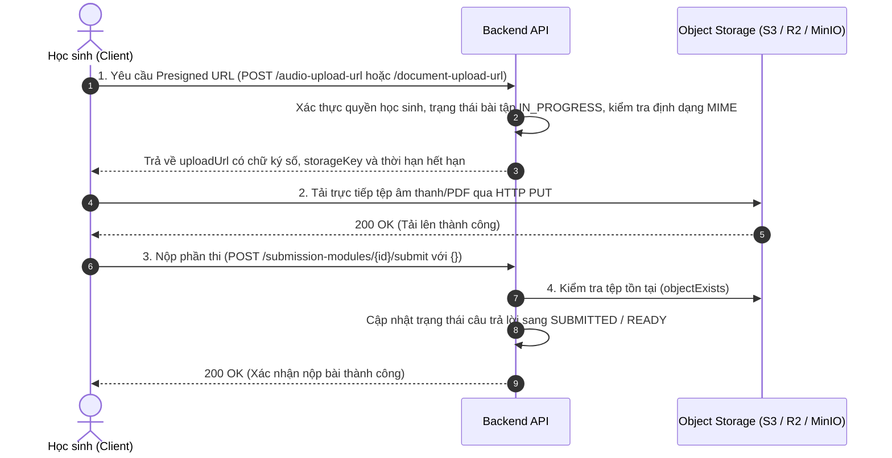

# Phụ Lục Đặc Tả Yêu Cầu Phần Mềm (SRS Addendum)

Tài liệu này bổ sung và hoàn thiện các nội dung kỹ thuật cho tài liệu gốc [`docs/core/01.SRS.md`](file:///d:/Codin/utc-code/HK4_1/Project1/EnglishHub/docs/core/01.SRS.md), phản ánh chính xác kiến trúc phần mềm, công nghệ giao diện và giải pháp lưu trữ đang vận hành trong dự án **EnglishHub**.

---

## 1. Nâng Cấp Kiến Trúc Backend: Domain-Driven Design & Hexagonal Architecture

So với mô hình MVC 3 lớp truyền thống trong tài liệu SRS ban đầu, Backend của EnglishHub được nâng cấp lên mô hình **Modular Monolith** áp dụng nguyên lý **Domain-Driven Design (DDD)** kết hợp **Kiến trúc Lục giác (Hexagonal Architecture / Ports and Adapters)**.

### 1.1. Cấu trúc phân tầng (Layering Model)

Mỗi mô-đun nghiệp vụ (ví dụ: `submission`, `grading`, `assignment`, `evaluation`) được tổ chức thành 4 phân tầng độc lập:

```text
com.english_hub.core.modules.<module_name>/
├── domain/                    # Tầng nghiệp vụ cốt lõi (Core Domain)
│   ├── model/                 # Thực thể (Entities), Đối tượng giá trị (Value Objects), Enums
│   ├── exception/             # Ngoại lệ nghiệp vụ thuần túy
│   └── service/               # Domain Services xử lý quy tắc nghiệp vụ phức tạp
├── application/               # Tầng ứng dụng (Application Layer)
│   ├── port/
│   │   ├── in/                # Input Ports (Use Case Interfaces cho Controller gọi vào)
│   │   └── out/               # Output Ports (Repository & Storage Interfaces)
│   └── service/               # Application Services điều phối luồng thực thi
├── infrastructure/            # Tầng hạ tầng (Infrastructure Layer)
│   ├── adapter/               # Triển khai các Output Ports
│   ├── persistence/           # JPA Entities, Spring Data Repositories, Mappers
│   └── storage/               # Triển khai lưu trữ đối tượng đám mây (S3, MinIO)
└── presentation/              # Tầng giao tiếp người dùng (Presentation Layer)
    └── rest/                  # REST Controllers, DTO Request/Response, Exception Handlers
```

### 1.2. Lợi ích kiến trúc
- **Cách ly nghiệp vụ (Domain Isolation)**: Tầng Domain hoàn toàn độc lập với các thư viện bên ngoài và framework Spring Boot, giúp dễ dàng viết Unit Test mà không cần nạp context nặng nề.
- **Dễ bảo trì và mở rộng**: Việc thay đổi cơ sở dữ liệu hoặc dịch vụ lưu trữ (Storage) chỉ diễn ra ở tầng Infrastructure mà không ảnh hưởng đến logic nghiệp vụ cốt lõi.

---

## 2. Giải Pháp Lưu Trữ Tệp Đối Tượng Trừu Tượng (Provider-Agnostic S3 Storage)

Tài liệu SRS ban đầu chỉ định cứng Cloudflare R2. Nhằm phòng ngừa rủi ro phụ thuộc vào một nhà cung cấp duy nhất (Vendor Lock-in) và cho phép linh hoạt thay đổi dịch vụ trong tương lai, hệ thống đã xây dựng lớp lưu trữ đối tượng trừu tượng tương thích chuẩn **Amazon S3 API**.

### 2.1. Cổng giao tiếp trừu tượng (`StorageService`)
Giao diện cổng lưu trữ định nghĩa hai phương thức cốt lõi:
- `generatePresignedPutUrl(String storageKey, String contentType, Duration ttl)`: Khởi tạo URL ký trước có thời hạn (mặc định 15 phút) cho phép client tải tệp trực tiếp lên bucket mà không cần truyền qua server.
- `objectExists(String storageKey)`: Kiểm tra sự tồn tại của tệp trên bucket sau khi client hoàn tất tải lên.

### 2.2. Cơ chế thích ứng đa nền tảng
Hệ thống hỗ trợ 2 triển khai (Bean implementation) thông qua cờ cấu hình `app.storage.s3.enabled`:
1. **`S3StorageService` (khi bật `enabled=true`)**: Sử dụng AWS SDK v2 (`S3Client`, `S3Presigner`) với tính năng ghi đè endpoint (`endpointOverride`) và hỗ trợ truy cập `path-style`. Nhờ đó, hệ thống tương thích 100% với:
   - **Cloudflare R2** (môi trường staging/production)
   - **AWS S3** (môi trường enterprise)
   - **Neon Storage** (môi trường cloud database)
   - **MinIO Container** (môi trường local dev và CI integration test)
2. **`UnavailableStorageService` (khi tắt `enabled=false`)**: Cho phép hệ thống khởi động an toàn ngay cả khi máy tính của lập trình viên không có kết nối Internet hoặc chưa cấu hình khóa truy cập lưu trữ.

### 2.3. Quy trình nộp bài tệp ghi âm và bài luận


---

## 3. Chuẩn Hóa Danh Mục Công Nghệ Frontend

Tài liệu SRS ban đầu liệt kê cả Ant Design và Shadcn cùng lúc. Nhằm đảm bảo kích thước gói tải (bundle size) tối ưu, hiệu năng hiển thị cao nhất và tránh xung đột CSS, danh mục công nghệ giao diện chính thức được chuẩn hóa như sau:

- **Khung ứng dụng chính**: React phiên bản 19 kết hợp trình biên dịch và đóng gói siêu tốc Vite.
- **Ngôn ngữ**: TypeScript 5.x đảm bảo an toàn kiểu dữ liệu (Strict Type-safe).
- **Bộ icon giao diện**: Lucide React (thư viện icon tối giản, hiện đại và chuẩn hóa).
- **Điều hướng**: React Router v7.
- **Kiểu dáng và bố cục**: Tailwind CSS và Vanilla CSS Modules, hoàn toàn không phụ thuộc vào Ant Design hay Shadcn UI.

---

## 4. Đặc Tả Bổ Sung Về An Toàn Thông Tin & Phân Quyền (RBAC)

1. **Xác thực phi trạng thái (Stateless JWT)**:
   - Access Token được ký bằng thuật toán đối xứng HMAC SHA-256 (HS256) với thời gian sống ngắn.
   - Refresh Token được băm một chiều bằng giải thuật **SHA-256** trước khi lưu vào bảng `refresh_tokens.token_hash`, ngăn chặn tuyệt đối nguy cơ rò rỉ token nếu cơ sở dữ liệu bị lộ.
2. **Kiểm soát phân quyền đa tầng theo vai trò**:
   - **Admin**: Quyền truy xuất toàn cục, không bị giới hạn theo lớp học.
   - **Teacher**: Bắt buộc kiểm tra quyền sở hữu lớp học (`ClassTeachingRepository`). Giáo viên chỉ có quyền tạo bài tập, xem bài làm và chấm điểm đối với các lớp mình đang phụ trách.
   - **Student**: Chỉ được làm bài và nộp bài trong phạm vi các lớp đã được ghi danh (`StudentClassEnrollmentRepository`), trong khung thời gian mở bài (`open_at` <= hiện tại < `close_at`) và không vượt quá số lượt làm bài tối đa (`max_submissions`).
