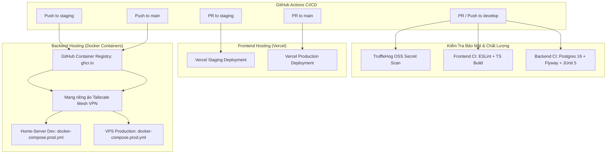

# Phụ Lục Vận Hành & Triển Khai (DevOps & Deploy Addendum)

Tài liệu này bổ sung và hoàn thiện kế hoạch triển khai cho tài liệu gốc [`docs/core/02.PP.md`](file:///d:/Codin/utc-code/HK4_1/Project1/EnglishHub/docs/core/02.PP.md), cung cấp chi tiết kiến trúc CI/CD, cơ chế mạng riêng ảo Tailscale, quy trình phân nhánh Git Flow và lộ trình chuyển đổi hạ tầng trong tương lai.

---

## 1. Mô Hình Triển Khai Thực Tế Đa Tầng (Multi-Tier Deployment Architecture)

Khác với kế hoạch triển khai đơn giản ban đầu, hệ thống áp dụng mô hình phân tách độc lập giữa Frontend (Static Jamstack trên Vercel Edge Network) và Backend (Docker Containers trên máy chủ nội bộ / VPS) nhằm tối ưu chi phí và tăng tốc độ phân phối nội dung:

---

## 2. Kết Nối Máy Chủ An Toàn Bằng Mạng Riêng Ảo Tailscale Mesh VPN

### 2.1. Vấn đề của mô hình SSH truyền thống
Trong mô hình triển khai thông thường, máy chủ VPS hoặc Home-Server phải mở cổng SSH công khai (Port 22) ra ngoài Internet để GitHub Actions runner kết nối. Điều này dẫn đến nguy cơ bị tấn công dò quét cổng (Port Scanning) và tấn công vét cạn mật khẩu (Brute-Force Attack) liên tục.

### 2.2. Giải pháp Tailscale Overlay Network
- Dự án sử dụng giải pháp **Tailscale Mesh VPN** (`tailscale/github-action@v2`) với khóa xác thực dùng một lần (`TAILSCALE_AUTHKEY`).
- Khi workflow CD kích hoạt, GitHub Actions runner tạm thời tham gia vào mạng nội bộ riêng của nhóm phát triển.
- Runner thực hiện SSH và gửi lệnh deploy tới máy chủ thông qua địa chỉ IP nội bộ bảo mật (ví dụ: `100.x.y.z`), hoàn toàn không cần mở bất kỳ cổng nào ra Internet công cộng.

---

## 3. Hệ Thống 8 GitHub Actions Pipelines Tự Động Hóa

Dự án vận hành 8 tệp workflow chuyên trách trong thư mục [`.github/workflows/`](file:///d:/Codin/utc-code/HK4_1/Project1/EnglishHub/.github/workflows):

1. **`security-scan.yml`**: Quét rò rỉ mã bí mật (API Keys, Token, Mật khẩu) bằng TruffleHog OSS trên toàn bộ lịch sử git trước khi cho phép merge.
2. **`ci-backend.yml`**: Khởi chạy PostgreSQL 16 Alpine container, kiểm tra tính toàn vẹn của kịch bản Flyway migrations, thực thi 286 automated tests và đóng gói JAR.
3. **`ci-frontend.yml`**: Kiểm tra quy chuẩn cú pháp ESLint, rà soát kiểu dữ liệu TypeScript và build gói bundle bằng Vite.
4. **`cd-frontend-development.yml`**: Tự động triển khai bản thử nghiệm Frontend lên Vercel Staging khi có Pull Request vào nhánh `staging`.
5. **`cd-frontend.yml`**: Tự động triển khai phiên bản Frontend chính thức lên Vercel Production khi có Pull Request vào nhánh `main`.
6. **`cd-backend-development.yml`**: Tự động đóng gói Docker image, push lên GHCR, kết nối Tailscale VPN và triển khai vào thư mục `/home/$USER/englishhub-dev` trên máy chủ thử nghiệm.
7. **`cd-backend.yml`**: Tự động đóng gói Docker image và triển khai vào thư mục `/home/$USER/englishhub` trên máy chủ Production khi push vào `main`.
8. **`cd-deploy.yml`**: Pipeline đóng gói toàn diện sử dụng Docker Buildx với GitHub Actions Layer Cache (`type=gha`), hỗ trợ deploy qua SSH và tự động kiểm tra trạng thái container sau khi triển khai (Post-Deploy Healthcheck).

---

## 4. Hướng Dẫn Chuyển Đổi Hạ Tầng Trong Tương Lai (Future Migration Guide)

Để thích ứng khi dự án phát triển quy mô lớn hơn hoặc thay đổi công nghệ triển khai:

### 4.1. Kịch bản chuyển đổi sang Kubernetes (K8s)
- Các Docker Image được đóng gói tại `ghcr.io/hotung9108/english-hub-backend` và `frontend` đều tuân thủ chuẩn OCI (Open Container Initiative) nên hoàn toàn tương thích với Kubernetes.
- Khi chuyển đổi, nhóm chỉ cần tạo thêm thư mục `k8s/` chứa các tệp `deployment.yaml`, `service.yaml`, `ingress.yaml` và thay thế bước `docker compose up` trong workflow CD bằng lệnh `kubectl apply -f k8s/` hoặc công cụ ArgoCD / GitOps.

### 4.2. Kịch bản chuyển đổi sang Dịch vụ Đám mây Không máy chủ (Serverless / Cloud Run / AWS ECS)
- Vì Backend Spring Boot đã được đóng gói thành container độc lập, hệ thống có thể chuyển sang chạy trên **Google Cloud Run** hoặc **AWS ECS Fargate** chỉ bằng cách cập nhật bước triển khai trong GitHub Actions (dùng `google-github-actions/deploy-cloudrun` hoặc `aws-actions/amazon-ecs-deploy-task-definition`).
- Mọi cấu hình kết nối Database và S3 Storage đều được đọc qua biến môi trường tiêu chuẩn (`.env`), không yêu cầu sửa đổi bất kỳ dòng mã nguồn nào.
